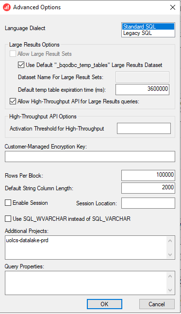
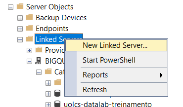
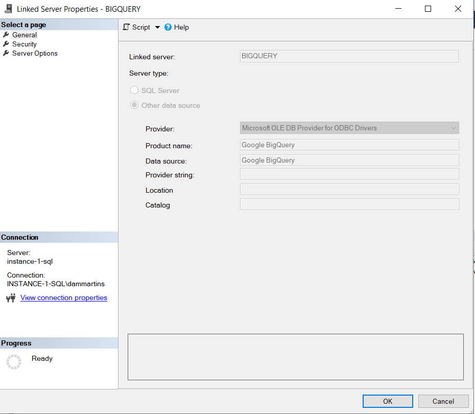

[Documentação](../../documentacao.md) > [How-to](../how-to.md)

# [SQLServer] Configurar Linked Server para BigQuery

# Passo 1: Configurar DSN

1. Instalar Driver ODBC: <https://cloud.google.com/bigquery/docs/reference/odbc-jdbc-drivers#current_odbc_driver>
2. Criar uma conta da serviço e gerar a chave em JSON
3. Configurar o DSN do BigQuery:
   1. 
   2. Adicionar email, arquivo da conta de serviço e projeto:
   3.  **IMPORTANTE: Em "Encrypt Sensitive Data" deixar selecionado "All Users"**
   4. Em Advanced Options:
      1. Habilitar "Use Default "\_bqodbc\_temp\_tables" Large Results Dataset
      2. Habilitar "Allow High-Throughput API for Large Results queries"
      3. mudar o "Default String Column Length" para menos de 8000, que é o limite do SQLServer
   5. 
4. Para comunicação via Private Endpoint, adicionar no hosts o respectivo IP:

   ```java
   10.224.83.192 bigquery.googleapis.com googleapis.com google.com
   10.224.83.192 oauth2.googleapis.com
   10.224.83.192 dl.google.com
   10.224.83.192 bigquerystorage.googleapis.com
   ```

# Passo 2: Adicionar o Linked Server

1. **Clicar em "New Linked Server"**  
   
2. **Selecionar:**
   1. **Other data source**
   2. Provider: **Microsoft OLE DB Provider for ODBC Drivers**
   3. Product Name: **Google BigQuery**
   4. Data source: **Google BigQuery**



**3. Mapear usuários para permitir utilizar o Linked Server:**

Mais infos em: <https://stackoverflow.com/questions/32084453/sql-linked-server-returns-error-no-login-mapping-exists-when-non-admin-account/71348521#71348521>

```java
USE [master]
GO
EXEC master.dbo.sp_addlinkedsrvlogin @rmtsrvname = N'BIGQUERY', @locallogin = N'datalake_eltubr', @useself = N'True'
GO
```
