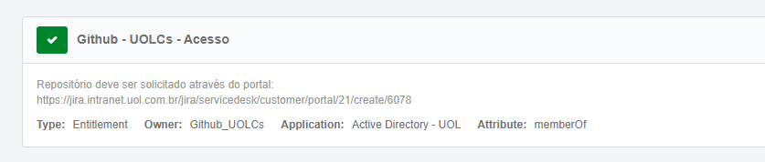
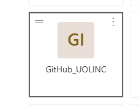
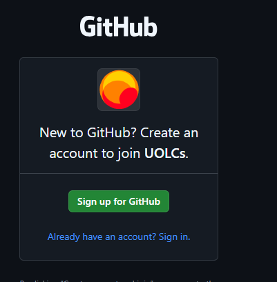
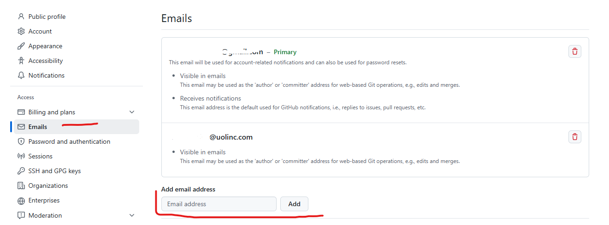
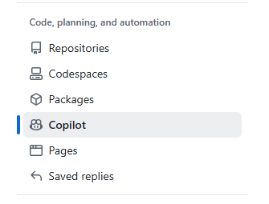
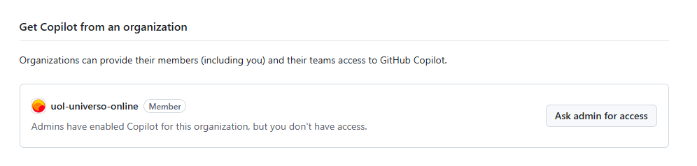

[Documentação](../../documentacao.md) > [How-to](../how-to.md)

# Acesso ao Github Copilot

## 1. Solicitar acesso via IDM 

## 2. Acessar Github via MyApps

<https://myapplications.microsoft.com/>

## 3. Vincular sua conta pessoal do GitHub ao UOLCS ou criar uma conta nova com seu uolinc

### 3.1. (Opcional) Se usar sua conta pessoal, vincule o email uolinc na conta:

## 4. Solicitar acesso ao copilot da organização

É o time do Norberto que faz a aprovação (P&D SRE UOLCS)

