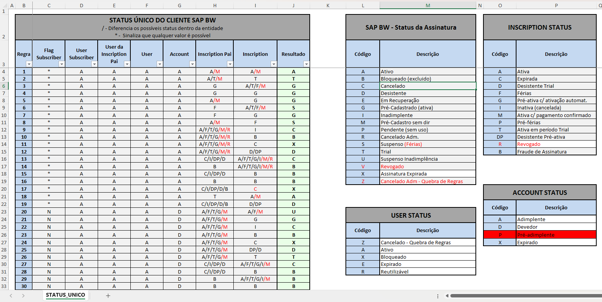
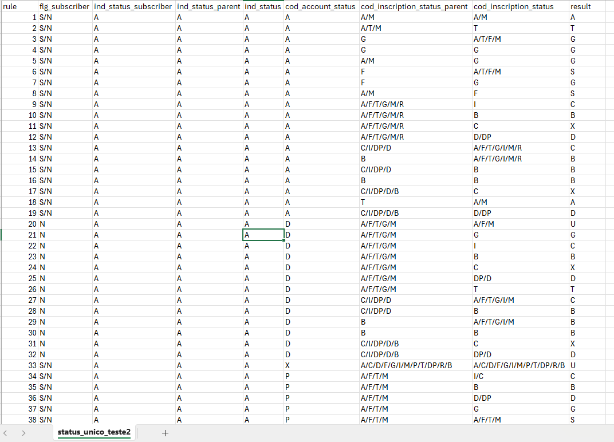
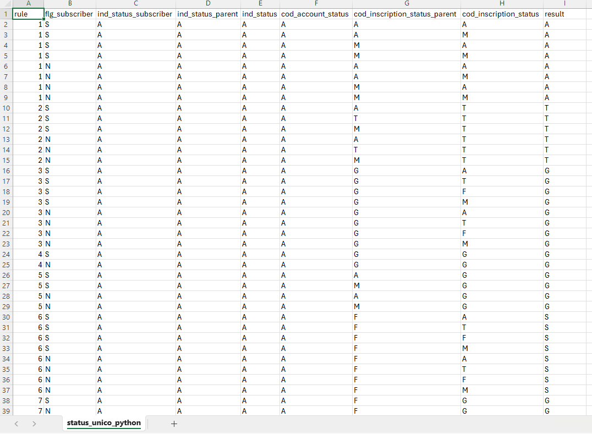

[Documentação](../../documentacao.md) > [How-to](../how-to.md)

# Cadastro - Geracao do arquivo de Status Unico

# Status Unico

O arquivo atual com as regras de Status Unico possuí agrupamentos por Status. Para tornar a tabela plana com todas as combinações possíveis e subir no Datalake, foi necessário ajustar o arquivo com o código abaixo.

Formato atual do arquivo de Status Unico.



## **Passos**

Copiar os dados da tabela com a combinação do Status Único para um novo arquivo, e ajustar o nome das colunas para o arquivo final, e salvar este arquivo como CSV.



Executar o código python abaixo.

**generate\_unique\_status\_rules.py**

```py
import pandas as pd
from itertools import product

# Ler o arquivo CSV de origem
source_file = 'Caminho/nome do arquivo de origem'
df = pd.read_csv(source_file, sep=';')

# Criar um novo DataFrame com as combinações
new_rows = []

for index, row in df.iterrows():
    columns_to_split = []
    for col in df.columns:
        if '/' in str(row[col]) and col != 'Regra':
            columns_to_split.append(col)
    if not columns_to_split:
        new_rows.append(row)
    else:
        values = [row[col].split('/') if '/' in str(row[col]) else [row[col]] for col in columns_to_split]
        combinations = pd.MultiIndex.from_product(values)
        for comb in combinations:
            new_row = row.copy()
            for col, value in zip(columns_to_split, comb):
                new_row[col] = value
            new_rows.append(new_row)

expanded_df = pd.DataFrame(new_rows)

# Salvar os dados em um novo arquivo CSV
output_file = 'Caminho/nome do arquivo a ser gerado'
expanded_df.to_csv(output_file, index=False, sep=';')

print("Processo concluído com sucesso!")


```

Será gerado o novo arquivo com as regras com todas as combinações possíveis.

Ex: A rule 1 passou de 1 linha para 8 linhas no arquivo final, devido a quantidade de combinações possíveis.


