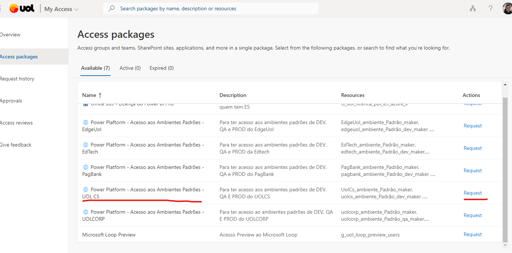
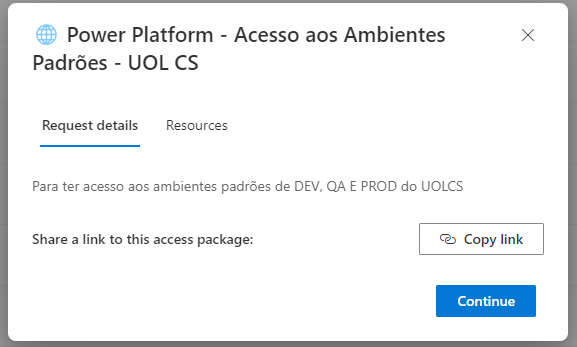
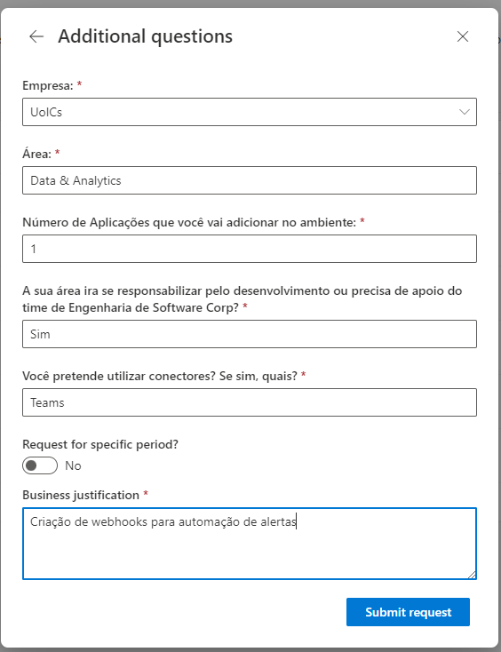
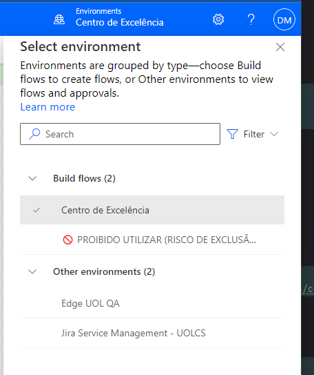
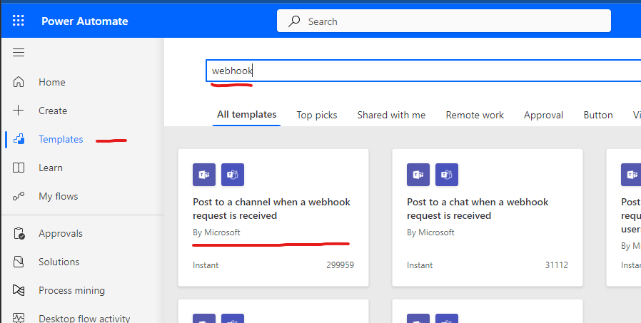
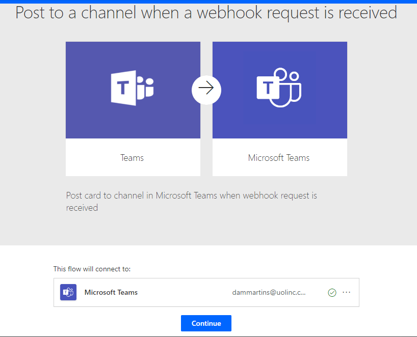
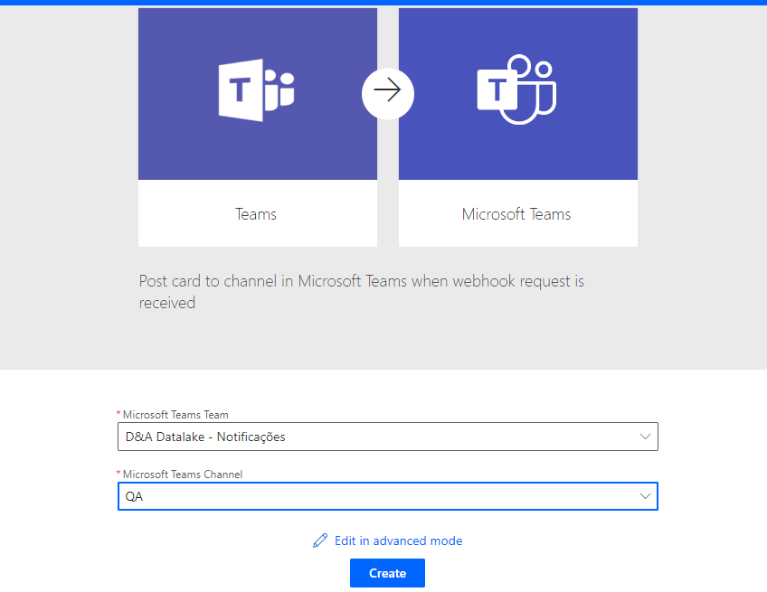
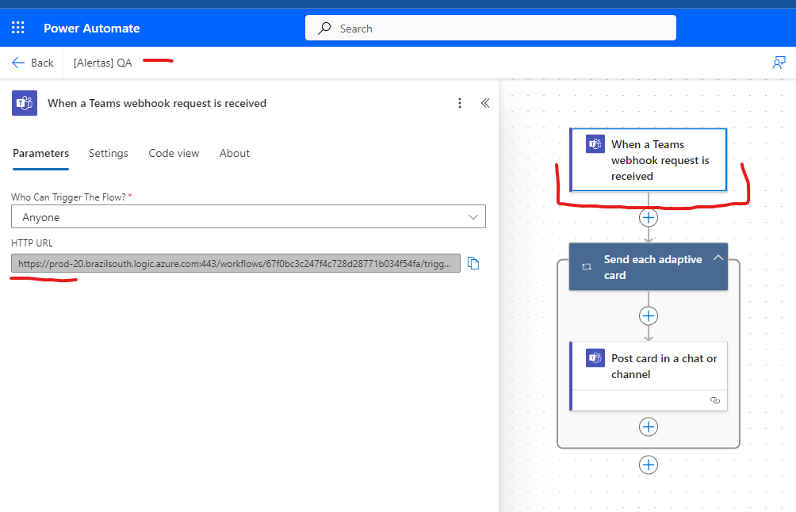

[Documentação](../../documentacao.md) > [How-to](../how-to.md)

# Como criar um webhook no Teams

# **Conectores - Fluxo depreciado**

Teams deixará de suportar conectores para migrar para Workflows.

A partir de agosto/24 não será possível gerar novos Webhooks.

Webhooks existentes continuarão a funcionar **somente até dezembro/24.**

**Sobre a migração:**

- [Retirement of Office 365 connectors within Microsoft Teams](https://devblogs.microsoft.com/microsoft365dev/retirement-of-office-365-connectors-within-microsoft-teams/)

# **Workflows - Fluxo novo (agosto/24)**

Atenção

Criar Workflows diretamente pelo Teams **não funciona** pois por padrão é usado o ambiente "**🚫 PROIBIDO UTILIZAR (RISCO DE EXCLUSÃO)**"

**0) Solicitar acesso aos ambientes padrões do UOLCS do Power Platform via My Access: <https://myaccess.microsoft.com/#/access-packages>**

**Mais detalhes: <https://uolinc.sharepoint.com/sites/SuporteCorporativo/SitePages/bem-vindo-a-power-plataform.aspx>**

**1) Acesse o Power Automate: <https://make.powerautomate.com/>**

**2) Selecionar o ambiente que usará a conexão**

****

**3) Em "Templates", selecione "Postar em um canal quando uma solicitação de webhook for recebida"**

****

**4) Selecione a conexão que será usada**

****

**5) Selecione o Time e Canal que receberá as mensagens**

****

**6) Após criação, vá em "Editar", clique na primeira caixa e copie a URL do webhook**

****
