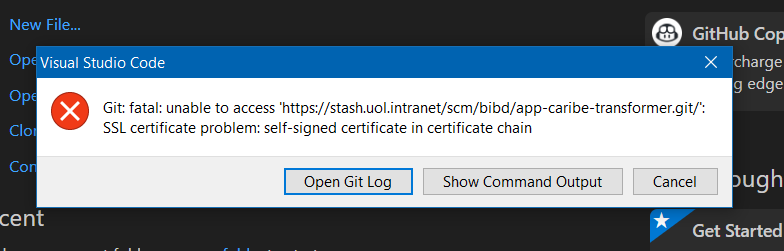
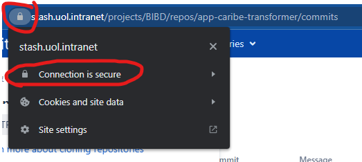
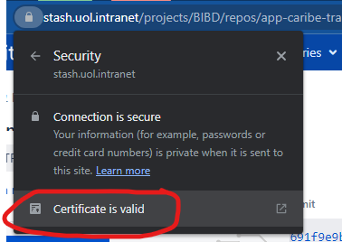
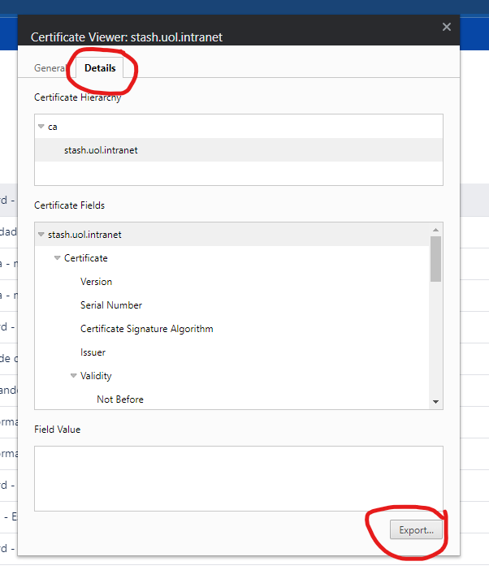

[Documentação](../../documentacao.md) > [How-to](../how-to.md)

# Instalar certificado SSL do Stash no Git

Para algumas pessoas, por conta do Zscaler, o Stash apresenta o seguinte erro ao fazer o clone via HTTP:



Para resolver, é necessário instalar o certificado SSL no Git:

1. Abra um repositório do Stash pelo navegador e clique no cadeado para exportar o certificado:







2. Isso vai gerar um arquivo "stash.uol.intranet.crt", agora precisa rodar esse comando no git pelo terminal, de preferência pelo Git Bash:

```bash
git config --global http.sslCAInfo <caminho-onde-salvou-o-arquivo>/stash.uol.intranet.crt
```
