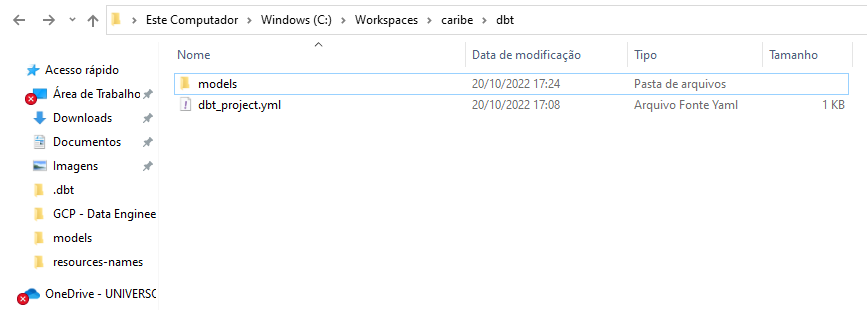
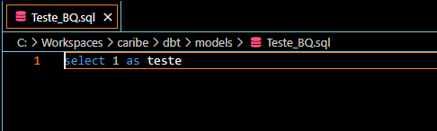

[Documentação](../../documentacao.md) > [How-to](../how-to.md)

# Rodar dbt local

- [Links úteis](#links-teis)
- [Instalação Redshift](#instala-o-redshift)
  - [PIP](#pip)
  - [Docker](#docker)
  - [Configuração](#configura-o)
- [Instalação BigQuery](#instala-o-bigquery)
  - [PIP](#pip)
  - [Configuração](#configura-o)
  - [Docker](#docker)

# Links úteis

<https://docs.getdbt.com/reference/resource-configs/spark-configs>  
<https://docs.getdbt.com/docs/building-a-dbt-project/building-models/configuring-incremental-models>  
<https://docs.getdbt.com/guides/getting-started/building-your-first-project/build-your-first-models>  
<https://docs.getdbt.com/docs/get-started/getting-started/getting-set-up/setting-up-bigquery#generate-bigquery-credentials>

# Instalação Redshift

## PIP

```bash
pip install dbt-redshift
```

## Docker

```bash
docker run \
--network=host \
--mount type=bind,source=/caminho/absoluto/para/projeto/,target=/usr/app \
--mount type=bind,source=/caminho/absoluto/para/profiles.yml,target=/root/.dbt/ \
ghcr.io/dbt-labs/dbt-redshift:latest \
<comando-do-dbt>
```

Exemplo via git bash:

```bash
docker run \
--network=host \
--mount type=bind,source=/c/Work/Workspaces/caribe/dbt-test/,target=/usr/app \
--mount type=bind,source=/c/Users/dammartins/.dbt/,target=/root/.dbt/ \
ghcr.io/dbt-labs/dbt-redshift:latest \
run
```

## Configuração

profiles.yml

**profiles.yml**

```yml
datalake_qa:
  target: dev
  outputs:
    dev:
      type: redshift 
      host: olago.qa.data.intranet
      user: <seu_user>
      password: <sua_senha>
      port: 5439
      dbname: datalake
      schema: dbt_caribe
      threads: 4
```

dbt-project.yml

**dbt\_project.yml**

```yml
name: 'datalake_qa'

config-version: 2
version: '0.1'

profile: 'datalake_qa'

model-paths: ["models"]
seed-paths: ["seeds"]
test-paths: ["tests"]
analysis-paths: ["analysis"]
macro-paths: ["macros"]

target-path: "target"
clean-targets:
    - "target"
    - "dbt_modules"
    - "logs"

require-dbt-version: [">=1.0.0", "<2.0.0"]

models:
  datalake_qa:
      materialized: table
      staging:
        materialized: view
```

# Instalação BigQuery

## PIP

```bash
pip install dbt-bigquery
```

## Configuração

Caso não tenha uma conta de serviço no GCP, é necessário criar uma conforme este [link](https://docs.getdbt.com/docs/get-started/getting-started/getting-set-up/setting-up-bigquery#generate-bigquery-credentials). Caso já exista, é necessário informar o path do keyfile no arquivo de profiles.

profiles.yml

**profiles.yml**

```yml
datalake_qa:
  target: dev
  outputs:
    dev:
      type: bigquery
      method: service-account
      project: uolcs-caribe-qa
      dataset: tmp
      threads: 4
      keyfile: /root/.dbt/uolcs-caribe-qa-a5e841b0b583.json
      timeout_seconds: 300
```

Obs: O keyfile deve estar no mesmo path do arquivo profiles.yml.

dbt-project.yml

**dbt-project.yml**

```yml
name: 'datalake_qa'

config-version: 2
version: '0.1'

profile: 'datalake_qa'

model-paths: ["models"]
seed-paths: ["seeds"]
test-paths: ["tests"]
analysis-paths: ["analysis"]
macro-paths: ["macros"]

target-path: "target"
clean-targets:
    - "target"
    - "dbt_modules"
    - "logs"

require-dbt-version: [">=1.0.0", "<2.0.0"]

```

Criar a pasta "models", no mesmo path do arquivo "dbt\_project.yml".



Dentro da pasta, criar um arquivo .sql, para executar com o dbt, por default a query é salva em uma view, e precisa ter um alias para as colunas.



## Docker

```bash
docker run \
--network=host \
--mount type=bind,source=/caminho/absoluto/para/projeto/,target=/usr/app \
--mount type=bind,source=/caminho/absoluto/profiles/,target=/root/.dbt/ \
ghcr.io/dbt-labs/dbt-bigquery:latest \
<comando-do-dbt>
```

Exemplo via git bash:

```bash
docker run \
--network=host \
--mount type=bind,source=/c/Workspaces/caribe/dbt,target=/usr/app \
--mount type=bind,source=/c/.dbt,target=/root/.dbt/ \
ghcr.io/dbt-labs/dbt-bigquery:latest \
run
```
