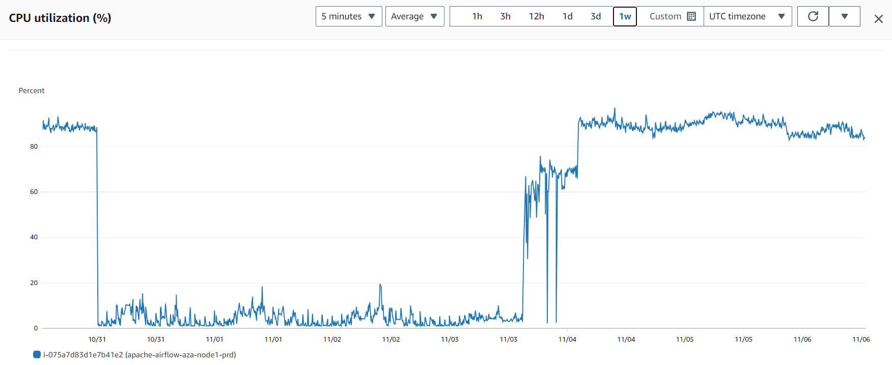
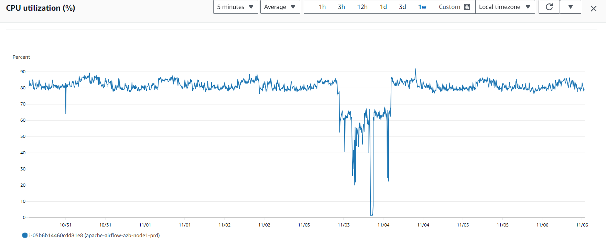

[Documentação](../../documentacao.md) > [Incidentes](../incidentes.md)

# 2023-11-03 - Postmortem - Instabilidade Airflow

## Data

2023-11-03

## Autores

- Damião Martins

## Status

Normalizado

## Resumo

Entre as 11h do dia 2023-11-03 e 03h do dia 2023-11-04 o Airflow apresentava instabilidades para executar as Tasks.

Aparentemente o início do problema se deu com a parada do processo do Airflow na máquina AZA às 00h do dia 2023-10-31.

Dessa forma, o Airflow ficou com somente um nó saudável até o início da instabilidade.

O início da instabilidade pode ter se originado de muitas DAGs possuírem sensores que aguardam o término de outras DAGs. Porém, com somente um nó executando, o número de slots para execução de Tasks fica limitado, podendo ocorrer um dead-lock, onde novas Tasks não se iniciam.

O problema foi identificado pelo time de Analytics, que reportou para o André acionar o time de engenharia.

## Timeline

2023-10-31 00h30: Scheduler parado na máquina AZA

2023-11-03 11h00: Uso de CPU começa a ficar instável na AZB

2023-11-03 15h20: Samer acionou André, que acionou engenharia

2023-11-03 15h30: Reiniciado o Scheduler na AZB

2023-11-03 16h00: Airflow segue instável, comecei a investigar DAGs com status "Running"

2023-11-03 16h30: Comecei a marcar como Failed DAGs com ExternalSensor e pausei DAGs que executavam mais de uma vez ao dia ou estavam com mais de uma execução pendente

2023-11-03 20h00: Reiniciado todos serviços do Airflow na AZA

2023-11-03 20h30: Reiniciado todos serviços do Airflow na AZB

2023-11-03 21h00: Airflow ainda apresentava uso de CPU instável em ambas as máquinas e não conseguia iniciar tasks enfileiradas. Devido a falta de energia em SP, Edgar não conseguia acessar as máquinas para continuar investigação.

2023-11-03 22h30: Vasyl criou grupo no Whatsapp com Edgar, Evandro e Damião. Combinado de esperar o dia seguinte para ver se voltava energia em SP e Egdar ajudar a investigar o problema.

2023-11-04 03h00: Uso de CPU estável em ambas as máquinas

2023-11-04 08h30: Acessei Airflow e notei que as Tasks pendentes aviam rodado e novas Tasks estavam rodando normalmente. Envolvidos foram notificados.

## Causa raiz

- Um nó ficou parado por dias
- Com somente um nó disponível, Airflow ficou sobrecarregado
- Muitas DAGs com ExternalSensor dependem de muitos slots disponíveis, com somente um nó acabou gerando uma espécie de dead-lock
- Mesmo após restart, como ficou muitas tasks pendentes o Airflow demorou para se recuperar

## Resolução

Reiniciar as máquinas não teve uma resposta imediata na resolução, mas parece ter ajudado.

## Correções e medidas preventivas

- Monitoração: Também evidenciou a falta de uma monitoração ativa, que poderia ter evitado o incidente ao notar a máquina parada
- Upgrade do ambiente: Airflow está rodando no limite de capacidade das máquinas. Podemos tentar melhorar a infra e priorizar a migração para o GCP.
- Comunicação: Incidente evidenciou a falta de um canal central para comunicação entre os times que utilizam Airflow/Datalake
- Plano de ação: Poderíamos montar um plano de ação para resposta a incidentes, com quais ações executar e um passo a passo. Exemplo: quais logs olhar, onde verificar as Tasks pendentes, uso de recursos etc.

---

## Referências

- <https://github.com/dastergon/postmortem-templates/blob/master/templates/postmortem-template-google-api-infra.md>
- <https://www.atlassian.com/incident-management/postmortem/templates#incident-summary>
