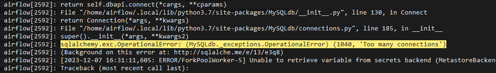
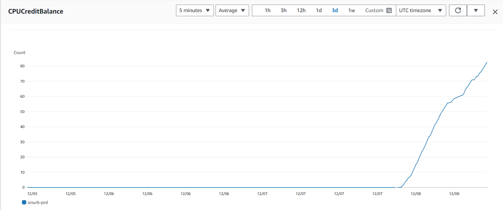
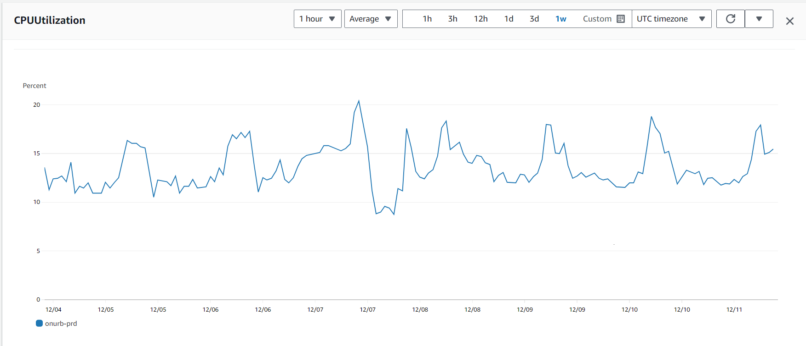

[Documentação](../../documentacao.md) > [Incidentes](../incidentes.md)

# 2023-12-07 - Postmortem - Instabilidade Airflow

## Data

2023-12-07

## Autores

- Mayara de Oliveira Holanda
- Damião Martins

## Status

Normalizado

## Resumo

As 9h do dia 2023-12-07 observei que nenhuma DAG estava sendo executada no Airflow. Naquele momento, todos os slots (12) disponíveis estavam alocados na execução de 3 dags.

As duas dags que estavam alocando 11 dos 12 slots possuem múltiplas execuções por dia. Ambas utilizam o CloudRunJobOperator e as dags ficaram paradas nessa etapa. Como as tasks de chamada da Cloud Run ficaram com status "em execução", as outras DAGs começaram a ficar enfileiradas.

O problema foi identificado pelo time de Caribe, que reportou para o Devops atuar.

## Timeline

2023-12-07 5h00: Todos os slots ficaram alocados com tasks travadas com status "Running"

2023-12-07 9h15: Identifiquei que nenhuma DAG estava sendo executada e acionei Evandro e Edgar

2023-12-07 9h30: Marquei como vermelho o status de todas as tasks que estavam travando a fila e desativei as 2 dags que tinham múltiplas execuções atrasadas. Assim as dags que estavam enfileiradas começaram a executar.

2023-12-07 9h45: Informei os times de engenharia envolvidos.

2023-12-07 10h30: Informei usuários do Grupo no teams "Notificações - Acessos"

2023-12-07 13:30: As tasks pararam de ser executadas, então informei Devops.

2023-12-07 13:50: Reiniciado scheduler da AZB.

2023-12-07 14:20: Reiniciado todos os serviços do Airflow.

2023-12-07 15:00: Parado todos os serviços do Airflow e tentativa de subir uma máquina por vez. Não surtiu efeito, tasks começavam e logo depois parava e não começavam novas.

2023-12-07 15:30: Redução dos workers do Celery Executor de 12 para 6.

2023-12-07 16:00: Pausada e marcada como falha DAGs com execução intraday, todas de Bate-papo, Gaudi e algumas outras que estavam em Running a muito tempo.

2023-12-07 17:00: Identificado nos logs do Celery que tasks não estava conseguindo iniciar por erro ao se conectar no RDS.

2023-12-07 18:00: Tasks começam a executar, mas em um ritmo muito lento. Pareceu um reflexo de pausar DAGs travadas e nesse horário tem poucos agendamentos.

2023-12-07 21:00: Evandro fez upgrade do RDS para t3.small e aumentou slots para 45.

2023-12-07 21:30: DAGs enfileiradas terminam com sucesso.

2023-12-07 22:00: Reativada DAGs pausadas durante o dia e limpado status de execução para rodarem novamente.

2023-12-07 22:30: Airflow normalizado.

## Causa raiz

- Dimensionamento da máquina de banco de dados. Temos 292 DAGs ativas e cada uma delas contém multiplas tasks.
- O RDS estava utilizando uma intância t3.micro. Instâncias t3 funcionam em um esquema de créditos, porque foram projetadas para cargas de trabalho inconstantes. No caso da t3.micro, o baseline de consumo de CPU é 10%: se usar menos acumula crédito e se usar mais a máquina é "capada" nos 10%. Estavamos usando mais de 10% o tempo todo, causando esse throttle na CPU e novas tasks não iniciavam por não conseguir conectar no banco.
  - Mais infos: <https://docs.aws.amazon.com/AWSEC2/latest/UserGuide/burstable-credits-baseline-concepts.html#earning-CPU-credits>

- **Erro no Celery Executor ao tentar executar uma task:**  
  
- **Consumo de créditos antes x depois do upgrade para t3.small**  
  

- **Evidência de uso de CPU acima do baseline 10%;**  
  

## Resolução

- Upgrade da instância do RDS de t3.micro para t3.small, que possui baseline de CPU de 20%.
- Redução dos Celery Executors em cada máquina: de 12 para 6
- Aumento dos slots do "Default pool" de 12 para 45.

## Correções e medidas preventivas

- Redução dos workers do Celery Executor para 6 (era 12)
- Upgrade do ambiente: Airflow está rodando no limite de capacidade das máquinas. Podemos tentar melhorar a infra e priorizar a migração para o GCP.

---

## Referências

- <https://github.com/dastergon/postmortem-templates/blob/master/templates/postmortem-template-google-api-infra.md>
- <https://www.atlassian.com/incident-management/postmortem/templates#incident-summary>
