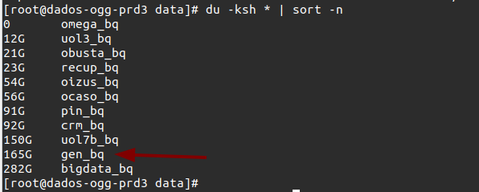
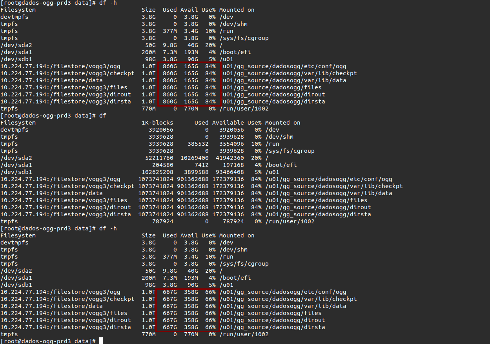
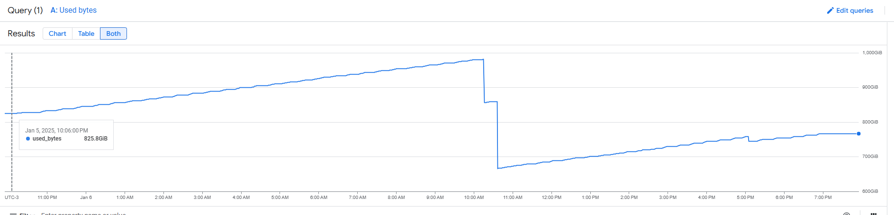
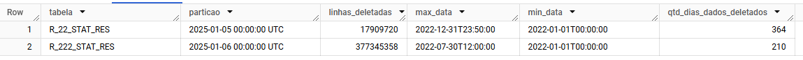

[Documentação](../../documentacao.md) > [Incidentes](../incidentes.md)

# 2025-01-06 - Postmortem - Disco OGG

## Data

2025-01-06

## Autores

- Damião Martins
- Evandro Bucci

## Status

Normalizado

## Resumo

NFS do OGG alarmou por conta do aumento de espaço utilizado. Volume foi causado pelos trails do Genesys. Evandro e Edgar atuaram quando disco estava em 98%, apagando trails mais antigos. Não houve indisponibilidade, mas por conta do volume, replicat do Genesys ficou com mais de 2h de lag durante todo o dia.

## Timeline

2025-01-06 10h12: Edgar acionou Caribe avisando do aumento de consumo do disco. Trails do Genesys sairam de 6gb para 170gb em menos de 24h

2025-01-06 10h30: Evandro e Edgar reduziram a retenção dos trails de UOL7 de BI e D&A de 60 para 30 dias

2025-01-06 10h30: Evandro e Edgar acionaram time de DBAs para tentar identificar a causa do aumento do volume nos trails de Genesys

2025-01-06 12h00: Analisando registros recebidos nas tabelas do Genesys, identificamos que a causa foram purgas de 2022 realizadas nas tabelas, gerando o volume anormal.

2025-01-06 17h30: DBAs pararam os processos do Genesys

2025-01-06 18h54: DBAs fizeram restart do módulo

2025-01-06 19h00: Volume de trails normalizado

## Causa raiz

Problema foi causado por uma purga que é feita nas tabelas do Genesys todo inicio de ano, para manter dados somente dos últimos dois anos completos.

- Consumo do disco no momento da identificação   
  
- Após purga:  
  
- 
- Volume de linhas deletadas:  
  

  ```sql
  SELECT
  'R_222_STAT_RES' as tabela,
  TIMESTAMP_TRUNC(_PARTITIONTIME, DAY) as particao,
  COUNTIF(deleted) linhas_deletadas,
  --. COUNT(1).linhas,
  MAX(PARSE_DATETIME('%Y%m%d%H%M',SUBSTR(TIME_KEY,0,12))) max_data,
  MIN(PARSE_DATETIME('%Y%m%d%H%M',SUBSTR(TIME_KEY,0,12))) min_data,
  DATETIME_DIFF(MAX(PARSE_DATETIME('%Y%m%d%H%M',SUBSTR(TIME_KEY,0,12))), MIN(PARSE_DATETIME('%Y%m%d%H%M',SUBSTR(TIME_KEY,0,12))), DAY) as qtd_dias_dados_deletados
  FROM `uolcs-datalake-prd.genesys_ogg_ogenora_ccadm_ingestion.R_222_STAT_RES`
  WHERE TIMESTAMP_TRUNC(_PARTITIONTIME, DAY) >= TIMESTAMP("2025-01-01")
  AND deleted
  GROUP BY 1, 2
  ```

## Resolução

- DBAs pararam o processo de purga para reduzir o volume de trails gerados.
- Redução da retenção dos trails para consumir menos disco

## Correções e medidas preventivas

1. **Comunicação:** Alinhamento com os DBAs para avisar quando for ocorrer purgas de dados e podermos nos preparar.
2. Fazer purgas mais espaçadas, evitar fazer grandes purgas de uma só vez,
3. (Avaliar) Isolar extrator do Genesys. Não adiantaria só isolar o extrator, teria que isolar o NFS também.
4. (Avaliar) Isolar somente NFS do genesys, para evitar impacto nos outros trails.
5. Adicionado nova rotina de monitoramento para um alarme de Warning quando o disco atingir 60% de uso e um alerta de Critical quando atingir 80% do disco.
6. Realizar a expurga de todos os trails do OGG com retenção de 30 dias (crm\_bq / ocaso\_bq / oizus\_bq / pin\_bq). Após esse processo passaremos a aproximadamente 40% de uso de disco NFS possibilitando maior espaço de manobra em caso de novas altas cargas pontuais de dados.
7. Caso necessário, podemos aumentar o volume do NFS em incrementos de 250 GB sendo possível realizar o downgrade após a utilização.
8. Avaliar em detalhes o uso do NFS Service Tier Zonal em substituição do Enterprise. Essa nova modalidade otimiza os custos do NFS possibilitando o uso de 2 NFS distintos garantindo alta disponibilidade do serviço.

Contatos de DBA: Bruno Lugarezzi e Claudia Marin

---

## Referências
