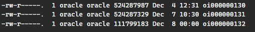
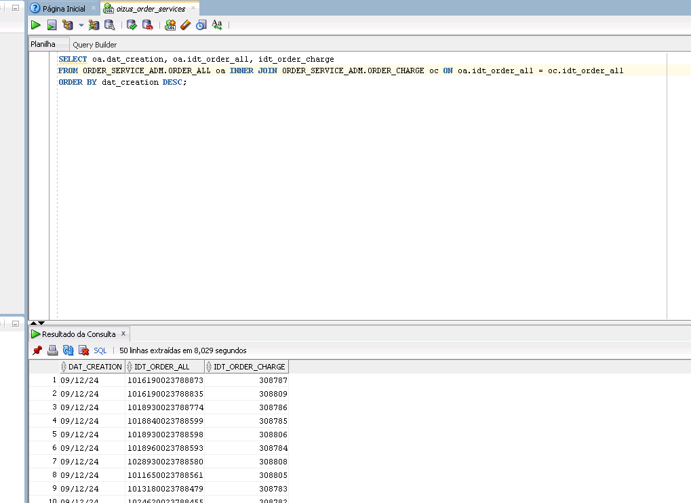
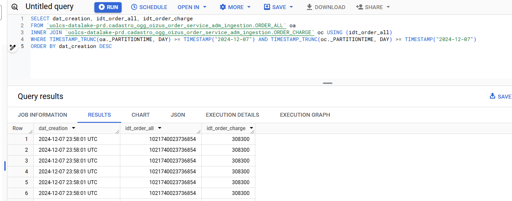
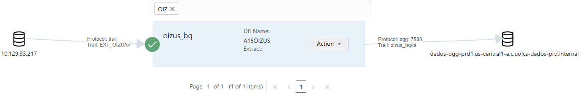
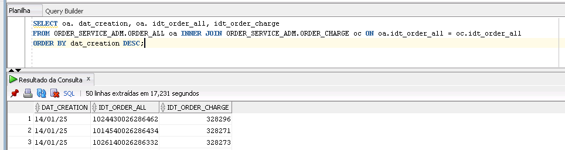
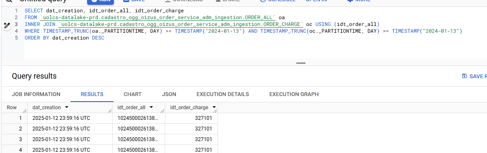

[Documentação](../../documentacao.md) > [Incidentes](../incidentes.md)

# 2025-01-14 - Postmortem - Travamento Extract Oizus

## Data

2025-01-14

## Autores

- Damião Martins

## Status

Em andamento

## Resumo

Deixamos de receber dados via OGG do banco Oizus por conta de "travamentos" do extrator do lado dos DBAs. Reiniciar o extrator resolve o problema pontualmente.

## Ocorrências

1. 2024-12-09
2. 2025-01-14
3. 2025-01-20

**2024-12-09:**

****

****

****

**2025-01-14:**







### Queries:

Oracle

```sql
SELECT oa.dat_creation, oa.idt_order_all, idt_order_charge
FROM ORDER_SERVICE_ADM.ORDER_ALL oa INNER JOIN ORDER_SERVICE_ADM.ORDER_CHARGE oc ON oa.idt_order_all = oc.idt_order_all
ORDER BY dat_creation DESC;|
```

BigQuery

```sql
SELECT TIMESTAMP_MICROS(timestampmicro) 
FROM `uolcs-datalake-prd.cadastro_ogg_oizus_order_service_adm_ingestion.ORDER_CHARGE` 
WHERE DATE(_PARTITIONTIME) >= DATE_SUB(CURRENT_DATE(), INTERVAL 1 DAY) OR _PARTITIONTIME IS NULL
OR _PARTITIONTIME IS NULL
ORDER BY 1 DESC
```

```sql
WITH order_charge AS (
SELECT dat_creation, idt_order_all, idt_order_charge
FROM `uolcs-datalake-prd.cadastro_ogg_oizus_order_service_adm_ingestion.ORDER_ALL` oa
INNER JOIN `uolcs-datalake-prd.cadastro_ogg_oizus_order_service_adm_ingestion.ORDER_CHARGE` oc USING (idt_order_all)
WHERE (TIMESTAMP_TRUNC(oa._PARTITIONTIME, DAY) >= TIMESTAMP("2024-01-13") OR oa._PARTITIONTIME is NULL) AND (TIMESTAMP_TRUNC(oc._PARTITIONTIME, DAY) >= TIMESTAMP("2024-01-13") OR oc._PARTITIONTIME is NULL)
ORDER BY dat_creation DESC
)
SELECT DATETIME_TRUNC(dat_creation, HOUR) hora, count(1) registros
from order_charge
GROUP BY hora
order by hora DESC
```

## Causa raiz

Travamento do extrator deixa de enviar os dados. Causa do travamento ainda desconhecida.

## Resolução

Reiniciar o extrator resolve o problema pontualmente

## Correções e medidas preventivas

- Comunicado time de DBA para avaliarem posssível monitoração
