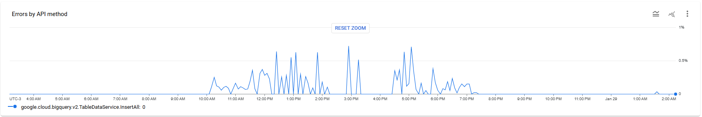
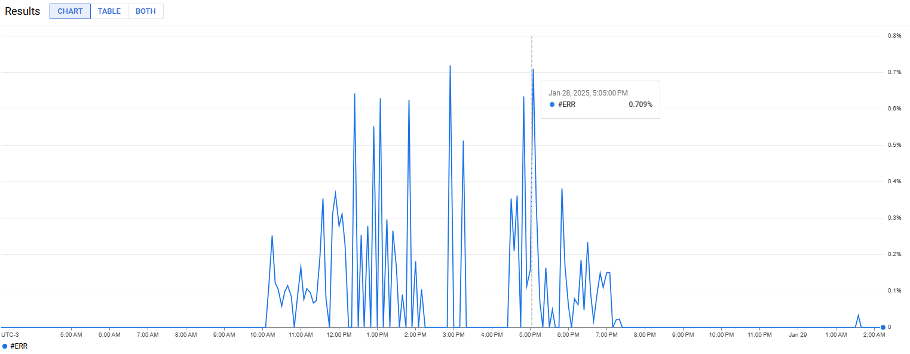
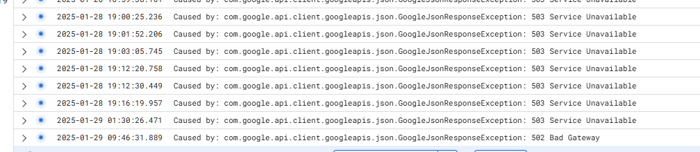

[Documentação](../../documentacao.md) > [Incidentes](../incidentes.md)

# 2025-01-29 - Postmortem - Instabilidade API BigQuery

## Data

2025-01-29

## Autores

- Damião Martins

## Status

Normalizado

## Resumo

A API do BigQuery tabledata.insertAll apresentou erro 503 durante todo o dia, que impactou a replicação dos dados do OGG. Problema ocorreu somente na máquina **dados-ogg-prd2**

## Timeline

2025-01-29 10h00: Começo de aumento de erros 503

2025-01-29 11h40: Replicats começaram a ficar com status abended e não voltar

2025-01-29 12h00: Tentei parar todos os replicats, mas nem todos pararm, os que estavam como abended continuaram tentando iniciar

2025-01-29 15h00: Ainda dando erro, paramos todos os replicats

2025-01-29 15h30: Evandro abriu chamado P1 no GCP: Case 56936239

2025-01-29 16h20: Google retorna chamado orientando a tentar novamente com exponential backoff e atualizar SDK

2025-01-29 16h40: Tentamos voltar a subir replicats alterando os parâmetros gg.handler.bigquery.batchSize=5000 e gg.handler.bigquery.batchFlushFrequency=5000. Alguns começaram a voltar, mas logo começaram a dar erro novamente.

2025-01-29 18h00: Tentamos atualizar BigQuery SDK para versão 2.46.0 e alterar batchSize dos replicats. Novamente alguns ficaram estáveis, mas outros replicats continuaram dando erro.

2025-01-29 19h00: Aumentamos o período para novas tentativas para 15min no Profile e deixamos somente os replicats do UOL7 rodando. Os demais ficaram parados.

2025-01-29 19h16: Último erro 503 registrado no dia

2025-01-29 19h45: Replicats do UOL7 estabilizaram rodando

2025-01-29 21h41: Bruno terminou de subir os demais replicats

## Causa raiz

Problema na API tabledata.insertAll, retornando 503 em algumas requisições, possivelmente causada por algum rate limit. Erro acontecia somente na máquina **dados-ogg-prd2**, na **dados-ogg-prd3** continuou funcionando.

Aumento dos erros na API durante período de instabilidade

<https://console.cloud.google.com/apis/api/bigquery.googleapis.com/metrics?inv=1&invt=AboJXw&project=uolcs-dados-prd&pageState=(%22duration%22:(%22groupValue%22:%22P2D%22,%22customValue%22:null))>

<https://console.cloud.google.com/monitoring/metrics-explorer;endTime=2025-01-29T05:13:47.413Z;startTime=2025-01-28T06:10:01.614Z?pageState=%7B%22domainObjectDeprecationId%22:%222B4EF109-AA4B-48A3-B191-2BD4DE56BF25%22,%22xyChart%22:%7B%22constantLines%22:%5B%5D,%22dataSets%22:%5B%7B%22legendTemplate%22:%22$%7BdisplayStringForLabel()%7D%22,%22plotType%22:%22LINE%22,%22targetAxis%22:%22Y1%22,%22timeSeriesFilterRatio%22:%7B%22denominatorFilter%22:%7B%22aggregations%22:%5B%5D,%22apiSource%22:%22DEFAULT_CLOUD%22,%22crossSeriesReducer%22:%22REDUCE_SUM%22,%22filter%22:%22metric.type%3D%5C%22serviceruntime.googleapis.com%2Fapi%2Frequest_count%5C%22%20resource.type%3D%5C%22consumed_api%5C%22%20resource.label.%5C%22project_id%5C%22%3D%5C%22uolcs-dados-prd%5C%22%20resource.label.%5C%22service%5C%22%3D%5C%22bigquery.googleapis.com%5C%22%20resource.label.%5C%22method%5C%22%3D%5C%22google.cloud.bigquery.v2.TableDataService.InsertAll%5C%22%22,%22groupByFields%22:%5B%22resource.label.%5C%22method%5C%22%22%5D,%22perSeriesAligner%22:%22ALIGN_RATE%22%7D,%22numeratorFilter%22:%7B%22aggregations%22:%5B%5D,%22apiSource%22:%22DEFAULT_CLOUD%22,%22crossSeriesReducer%22:%22REDUCE_SUM%22,%22filter%22:%22resource.type%3D%5C%22consumed_api%5C%22%20AND%20metric.type%3D%5C%22serviceruntime.googleapis.com%2Fapi%2Frequest_count%5C%22%20AND%20project%3D%5C%22uolcs-dados-prd%5C%22%20AND%20resource.labels.service%3D%5C%22bigquery.googleapis.com%5C%22%20AND%20resource.labels.method%3D%5C%22google.cloud.bigquery.v2.TableDataService.InsertAll%5C%22%20AND%20(metric.labels.response_code_class%3Done_of(%5C%224xx%5C%22,%20%5C%225xx%5C%22))%22,%22groupByFields%22:%5B%22resource.label.%5C%22method%5C%22%22%5D,%22minAlignmentPeriod%22:%2260s%22,%22perSeriesAligner%22:%22ALIGN_RATE%22%7D%7D%7D%5D,%22options%22:%7B%22mode%22:%22COLOR%22%7D,%22y1Axis%22:%7B%22label%22:%22%22,%22scale%22:%22LINEAR%22%7D%7D%7D&project=uolcs-dados-prd>

<https://console.cloud.google.com/logs/query;query=resource.type%3D%22gce_instance%22%20%0Aseverity%3E%3DDEFAULT%0Alog_name%3D%22projects%2Fuolcs-dados-prd%2Flogs%2Fogg_bq%22%0Alabels.%22compute.googleapis.com%2Fresource_name%22%3D%22dados-ogg-prd2%22%0AjsonPayload.message:%22Caused%20by:%20com%22;summaryFields=:false:32:beginning;cursorTimestamp=2025-01-29T12:46:31.889776554Z;duration=P2D?project=uolcs-dados-prd>

## Resolução

Aguardar API normalizar. Por ser um problema do lado do GCP, não tinhamos como fazer muita coisa.

Tentativa de otmizar parâmetros gg.handler.bigquery.batchSize e gg.handler.bigquery.batchFlushFrequency do OGG para tentar reduzir a quantidade de requisições.

Atualizado SDK do BigQuery, mas alterado somente em alguns replicats.

## Correções e medidas preventivas

- Uma hipótese é que tomamos o erro por um *rate limit* por ip de origem, por isso não impactou a máquina de engcorp.
- Podemos começar a dividir os replicats em máquinas menores, para diminuir o número de requisições por máquina.
- Deixar máquinas *spare* em outra região para chavear em caso de erros

Conversa com google 5/2/2025

- Ficaram de apoiar em novos incidentes
- Contato: Kauy Souza +55 11 94511-3745
