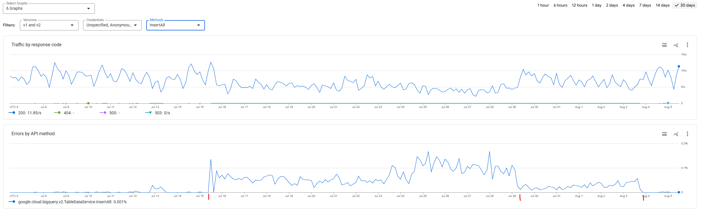

[Documentação](../../../documentacao.md) > [Incidentes](../../incidentes.md) > [2025-01-29 - Postmortem - Instabilidade API BigQuery](../2025-01-29-postmortem-instabilidade-api-bigquery.md)

# 2025-07-15: Instabilidade API BigQuery

## Ocorrência

Início: 2025-07-15

Redução: 2025-07-29

Normalização: 2025-08-04



## Ações

Adição parâmetros replicat:

```java
gg.handler.bigquery.batchSize=5000
gg.handler.bigquery.batchFlushFrequency=5000
gg.handler.bigquery.retries=3
gg.handler.bigquery.totalTimeout=600000
```
