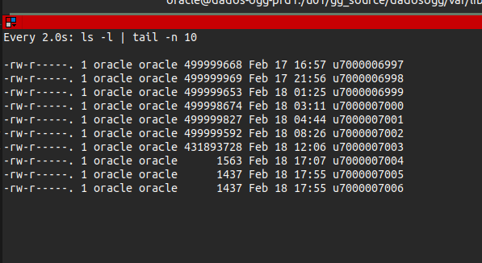
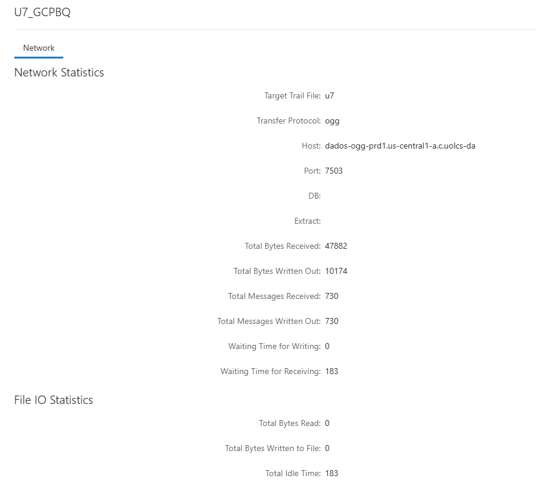

[Documentação](../../documentacao.md) > [Incidentes](../incidentes.md)

# 2026-02-18: Postmortem: OGG - Falha na replicacao de dados UOL7

## Data

2026-02-18

## Autores

- Damião Martins

## Status

Em andamento

## Resumo

Paramos de receber dados do UOL 7 pelo OGG, que impactou em todos os relatórios que usam dados de cadastro, cobrança e assinaturas.

## Timeline

2026-02-18 11h50: Tiago DBA fez inclusão de uma tabela (ACCT\_MGR\_UNION\_ADM.ACCOUNT\_DEDUCTION\_ADJUSTMENT) no extrator EXT\_U7BQ

2026-02-18 12h06: Paramos de receber dados no trail bigdata\_bq/u7

2026-02-18 13h29: Começamos a receber erro de source freshness nas DAGs do UOLBR

2026-02-18 16h37: Angeli avisa que está em contato com o Tiago DBA para tentar entender o problema

2026-02-18 17h00: Damião e Angeli começaram a investigar o que poderia estar causando o atraso

2026-02-18 17h20: Envolvidos Evandro e Edgar, eles verificaram que a última escrita no trail bigdata\_bq/u7 havia sido as 12h06

2026-02-18 17h24: Acionamos o Cezar DBA para verificar o que poderia estar causando o atraso

2026-02-18 18h00: Realizamos restart do Receiver

2026-02-18 18h30: Cezar fez restart do Extrator e Distribution, processo demora muito para iniciar porque máquina fica sobrecarregada

2026-02-18 20h30: Após vários restarts, resolvemos tentar criar um Distribution novo, sem filtros para tentar contornar o problema

2026-02-18 22h30: Mesmo após criar e aguardar o Distribution sincronizar, ainda não recebiamos nenhum dado no trail

2026-02-18 23h00: Sem muita evolução, paramos as tentativas e deixamos para continuar no dia seguinte

2026-02-19 8h00: Verificamos que o Distribution ainda não havia normalizado e disparamos o aviso para D&A

2026-02-19 10h00: Iniciamos uma nova chamada para tentar resolver o problema

2026-02-19 10h30: Novas tentativsa de recriar o Distribution, renomeando o processo

2026-02-19 11h30: Tentamos criar o novo Distribution apontando para nova máquina do OGG

2026-02-19 12h00: Coleta de evidencias para chamado na Oracle

2026-02-19 12h30: Aberto chamado para Oracle

2026-02-19 13h40: Cezar DBA encontrou uma configuração no filtro do Distribution: O Tiago ao incluir a nova tabela, mudou o filtro de INCLUDE para EXCLUDE, então não estavamos recebendo nenhuma tabela

2026-02-19 14h00: Começamos a receber os trails represados

2026-02-19 15h00: OGG reprocessou trails. Inicamos a reprocessar as DAGs

2026-02-19 17h00: Termino de reprocessar todas as DAGs raw

2026-02-19 18h00: Termino de reprocessar todas as DAGs curated

2026-02-19 18h08: Aviso de normalização no canal

## Causa raiz

Segundo Cezar, problema ocorreu por uma alteração no filtro do Distribution UOL7\_GCPBQ, onde o Tiago ao incluir a tabela nova, acabou mudando a regra do filtro de INCLUDE para EXCLUDE. Como nosso distribuiton tem praticamente todas as tabelas do extrator, deixamos de receber tudo.

## Resolução

Alterar o filtro do Distribution de volta para o tipo INCLUDE

## Correções e medidas preventivas

DBAs:

- Hoje todo o processo de criação e alteração de Extratores e Distributions são feitos manualmente pela tela
- Isso deixa mais suscetível a erros e não há rastreio das alterações
- Podemos apoiar o time dos DBAs para desenvolver uma automação para alteração dos Extracts e Distributions, trazendo mais rastrabilidade e consistencia no processo

D&A

- Vamos adicionar um alarme de *file age* nos arquivos de trail para conseguir identificar falhas na replicação mais rapidamente  
  [[AP11CAR-1597] [OGG] Alarme de file age nos trails](https://jira.intranet.uol.com.br/jira/browse/AP11CAR-1597)

---

## Referências
