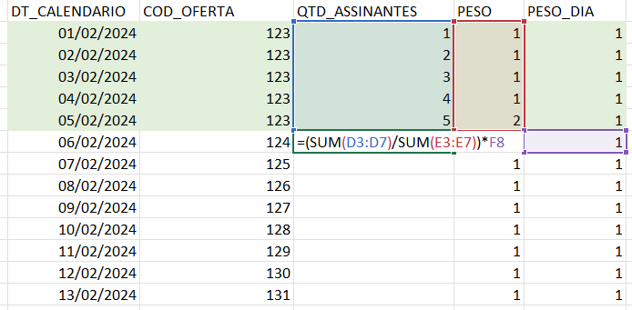
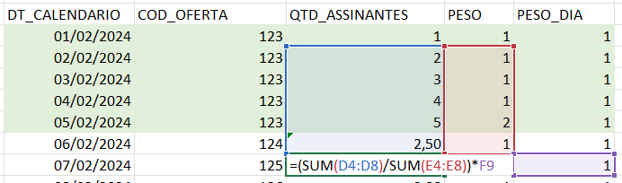

[Documentação](../../documentacao.md) > [Padroes e Diretrizes Tecnicas](../padroes-e-diretrizes-tecnicas.md)

# ADR - Migracao de Procedures

Na maioria dos casos é possível reescrever uma procedure como queries SQL no dbt. Mais detalhes em: [Guia para migracao de procedures para dbt](../gcp-google-cloud-platform/data-lake-gcp/transformacao-de-dados-no-datalake/guia-para-migracao-de-procedures-para-dbt.md)

Porém, existem alguns casos específicos que não é possível escrever diretamente via SQL.

Neste documento registramos as alternativas testadas e qual decisão foi tomada.

**Índice**

- [Status](#status)
- [Contexto](#contexto)
  - [Caso de exemplo: Projeção de vendas](#caso-de-exemplo-proje-o-de-vendas)
  - [Alternativas](#alternativas)
- [Decisão](#decis-o)
  - [Visão geral](#vis-o-geral)
  - [Detalhes do componente](#detalhes-do-componente)
- [Consequências](#consequ-ncias)

# **Status**

2024-02-29: Aceito

# **Contexto**

**[Proposta\_BQ\_staging\_analytics.pptx](https://uolinc.sharepoint.com/:p:/r/sites/RenatoCastroNeves/Documentos%20Compartilhados/D%26A/Squads/CAribe/Proposta_BQ_staging_analytics.pptx?d=wfa696131f0fc4ccd9cbd5caf355f2283&csf=1&web=1&e=emWYOn)**

**Resumo**

- Objetivo: acelerar migração dos processos do SQLServer para o BQ​  
  ​
- Prazo: dezembro/2024​  
  ​
- Problema atual: ​
  - ingestão de bases de dados no Datalake em WIP (ainda não finalizada)​
  - excesso de processos no SQLServer ​
  - regras complexas de negócios + sem documentação​
  - complexidade em migrar processos com novas ferramentas (migrar de procedures para queries via DBT)​
  - concorrência entre migração e novas demandas​  
    ​
- Impacto: desvincular o SAP Hana como fonte de dados para D&A + descontinuar SQLServer​  
  ​
- Principais times envolvidos: D&A Analytics + Engenharia Dados​

## Caso de exemplo: Projeção de vendas

Procedure:  [SPR\_IMP\_PROJECAO\_SAIDAS\_RD.sql](https://uolinc.sharepoint.com/:u:/r/sites/SquadCaribe/Documentos%20Compartilhados/General/Documentos/analytics/procedures/SPR_IMP_PROJECAO_SAIDAS_RD.sql?csf=1&web=1&e=sAjvbT)

Visão macro de como é feito o cálculo na procedure:

- Para um intervalo de datas do dia atual até o final do mês:
  - Calcula uma média ponderada dos últimos X dias com base em uma combinação de colunas
  - Repete este processo até o final do mês, fazendo uma janela deslizante. Então uma média calculada entra na média do dia seguinte

### Exemplo:

**Primeira iteração (dia 6/2)**

**Segunda iteração: (dia 7/2)**

Utiliza o resultado do dia 6/2 como entrada para o cálculo

## Alternativas

### A. dbt + python model

**Pontos positivos:**

- Centraliza transformação no dbt;
- Não precisa criar componente novo;
- Modularidade: Cada arquivo gera somente uma tabela e tem separação de camadas
- Rastreabilidade: Facilita a identificação de onde vem cada informação, quem é o responsável e o histórico de modificações
- Manutenibilidade:Ao quebrar uma procedure de milhares de linhas em partes menores e reutilizáveis facilita a manutenção, aumentando a velocidade de correções e melhorias.
- Testabilidade: Além disso, abre a possibilidade de inclusão de testes para garantir que uma alteração não mude uma regra de negócio e os dados estão de acordo com o esperado.

**Pontos de atenção:**

- Para casos complexos com loop precisa escrever o código em Python + SQL → curva de aprendizado
- No código python é possível modificar qualquer objeto no BigQuery que a conta de serviço tenha permissão; → mesmo problema com procedures
  - Precisaria segmentar a conta de serviço que executaria o python

### B. Procedures

**Pontos positivos:**

- Analytics está mais familiarizado com procedures

**Pontos de atenção:**

- Na procedure é possível modificar qualquer objeto do BigQuery que a conta de serviço tenha permissão; → mesmo problema com modelos python
  - Precisaria segmentar a conta de serviço que executaria as procedures para limitar a escrita
- Não teremos rastreio que qual procedure alimenta cada tabela; procedures podem gerar várias tabelas diferentes e procedures diferentes podem popular uma mesma tabela;
  - Perdemos a possibilidade de identificar de onde vem cada registro
- Para agendamento:
  - Precisaria criar um componente novo para agendamento; ou
  - liberar agendador do BigQuery direto no datalab
- Matadados e policy tags ficarão separadas
- Corre o risco de usarem esse fluxo para tudo

Caso siga por esse caminho:

#### B1. Liberar procedures direto no datalab via agendador do bigquery

- Não temos controle de quem vai cadastrar e histórico de modificações
- Usuários terão permissão de modificar a tabela diretamente no datalab

#### B2. Criar componente para entrega da procedure no datalab

- Semelhante ao DAG Maker, mas para executar somente procedures
- Usuários terão permissão de modificar a tabela diretamente no datalab

---

# **Decisão**

**Alternativa B2**

Para acelerar a migração para o BigQuery e viabilizar a reconstrução de processos inviáveis de serem reescritos somente com queries simples, será criado um novo componente que permitirá executar procedures.

**Premissas:**

- Procedures serão executadas e terão permissão de escrita somente no projeto "uolcs-datalake-prd-analytics"
- Procedures serão versionadas e entrega via automação, similar ao app-caribe-transformer;
- Automação executará somente procedures: não haverá nada parecido com dbt que cria tabelas particionadas, clusterizadas e cuida de cargas incrementas;
- Caso algum dado gerado por procedures precisem ser consumidos pelo uolcs-datalake-prd, será feito um link via Analytics Hub do dataset;

## Visão geral

## Detalhes do componente

Mais detalhes em: <https://confluence.intranet.uol.com.br/confluence/display/BD/%5BAnalytics%5D+Agendamento+de+procedures>

# **Consequências**

- Usuários nominais terão permissão de manipular tabelas geradas pela automação;
- Não teremos rastreio/linhagem de quais procedures manipulam cada tabela;
- Metadados precisarão ser aplicados utilizando o fluxo de Governança de Dados (metadata-loader);
- Datasets publicados via Analytics Hub no uolcs-datalake-prd poderão ser manipulados por usuários. Hoje isso não é possível, dados do Lake hoje só são manipulados por automação com versionamento;
- Não é possível estimar o consumo de uma procedure
