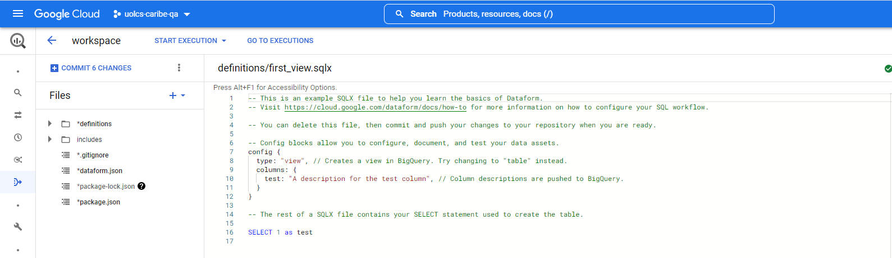
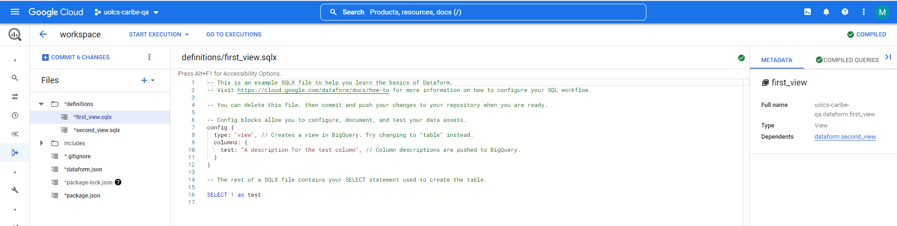
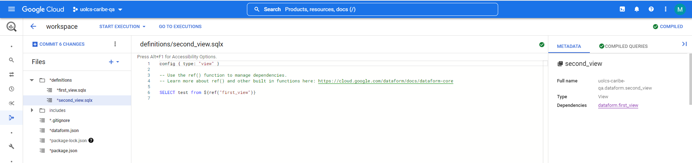
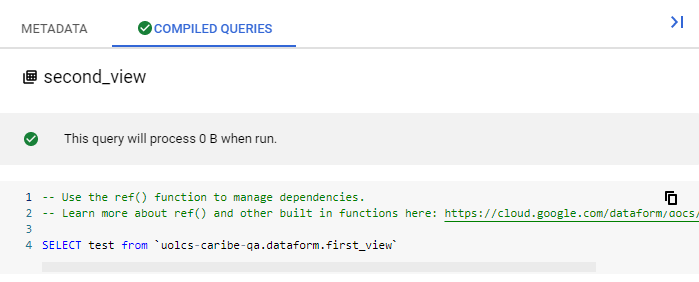
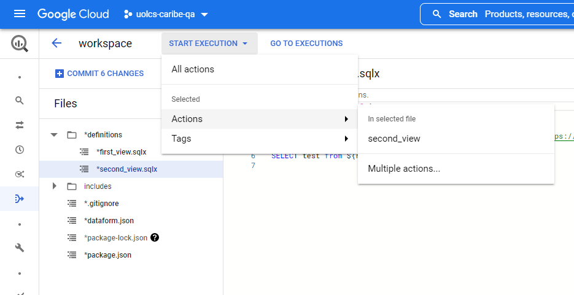
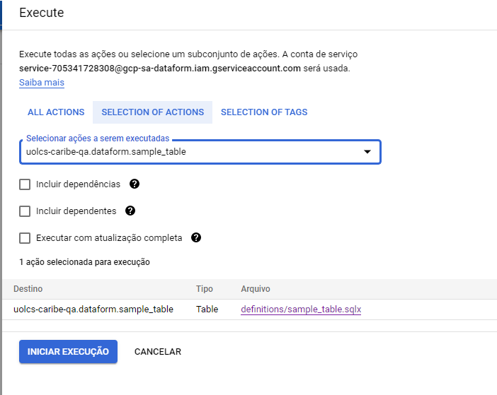
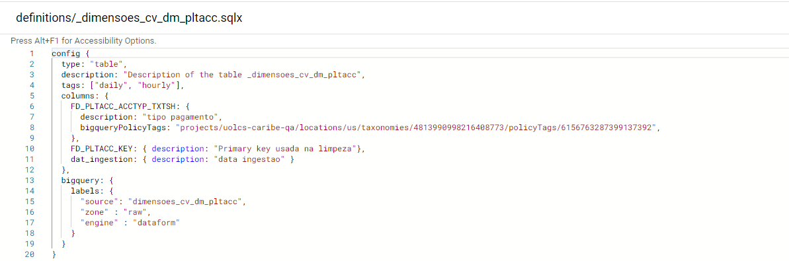
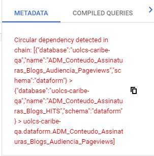

[Documentação](../../documentacao.md) > [POC](../poc.md)

# Dataform GCP

- [Overview](#overview)
- [Arquivo de config.](#arquivo-de-config)
- [Orquestração](#orquestra-o)
- [Requisitos de avaliação da POC](#requisitos-de-avalia-o-da-poc)
- [Conclusões](#conclus-es)

# Overview

O Dataform é uma ferramenta para transformação de dados, e está disponível como um serviço do GCP. Possuí integração apenas com o Github e Gitlab

Após criar um workspace, será aberto uma tela como essa abaixo.

Onde existem algumas pastas e arquivos que são responsaveis pelo funcionamento da ferramenta:

- **definitions** - local onde ficam os scripts .sqlx, com as respectivas transformações e metadados.
- **includes** - local para armazenamendo de funções js, que podem ser utilizados nos arquivos de transformações
- **dataform.json** - arquivo com as configurações do dataform, como destino dos dados, defaultschema, etc.
- **package.json** - arquivo de dependencias do Dataform

Por padrão o dataform já cria arquivos de modelo dentro da pasta definitions. No arquivo criado, há um bloco com as configurações do arquivo, então é possível selecionar qual o tipo de objeto a ser criado no destino, e comentários que serão adicionados a coluna. No exemplo, o resultado da query será armazenado em uma view, cujo nome, será o mesmo do arquivo sqlx sem a extensao. ( first\_view).

É possível referenciar um arquivo dentro de outro, utilizando a sintaxe ${ref("arquivo.sqlx")}, e dessa forma criar dependencia entre os scripts, onde ele executa primeiro o script *first\_view.sqlx*, para depois executar o *secondi\_view.sqlx.* Além disso, do lado esquerdo há um painel com a aba compiled queries, ali é possível visualizar como a será compilada para execução

Para executar o scripts existem 3 formas:

- Executar todos os scripts
- Selecionas quais scripts serão executados
- Utilizar tags dentro dos arquivos para agrupar e informar a tag

Quando é selecionado quais scripts serão selecionados, há 3 opções:

- **Incluir dependências** - executa o script pai, e em seguida os scripts filho que possuam dependencia
- **Incluir dependentes** - executa um script filho, e em seguida executa os scripts pai
- **Executar** **com atualização completa** - para tabelas incrementais, os dados serão truncados, e inseridos novamente de acordo com os scripts

# Arquivo de config.

Há diversas configurações que podem ser adicionadas nos objetos, abaixo exemplos de tipos que utilizamos na POC.

**bigquery** - Metadados do objeto. Ex: descrição da tabela/coluna, policy tags, partição, etc

**dependencies** - Nome dos arquivos pai, que são dependentes. Ex: Script\_A precisa rodar antes do Script\_B, então dentro dele, é informado "dependencies: [ "Script\_B"],"

**schema** - Schema do destino, caso não seja informado, é utilizado o schemadefault do arquivo dataform.json

**tags** - Agrupamento lógico para execução dos scripts

**type** - Tipo de objeto que será criado. Ex: table, view, incremental, materialized

# Orquestração

Existem duas formas de orquestrar os scripts do Dataform:

-Utilizando airflow (dataform operator)

-GCP Workflows para gerar uma url POST + Cloud Schedule para realizar o agendamento.

# Requisitos de avaliação da POC

**Possibilidade de reprocessar o passado** - O Dataform permite, porém, é utilizando DML no script sqlx (delete com a data da partição), e por coluna de data como partição. Desta forma, ele permite mais de um dia por vez. \* Partição por \_partitiontime e \_partitiondate não possuem suporte

**Versionamento das queries** - Possuí integração com o github e gitlab, mas não com o bitbucket que nós utilizamos atualmente.

**Possibilidade de cadastrar várias queries sobre o mesmo assunto** - É possível agrupar os scripts utilizando TAGs  
    - **sem dependencia uma da outra; podem paralelizar** - As queries podem ser paralelizadas, o limite é a quantidade de consultas que o banco aguentar, pode limitar a quantidade com o parametro:"concurrentQueryLimit": 10

- **possibilidade de uma query depender de outra**- Possuí a config de dependencia, além de poder referenciar o nome de um outro scripts

   - **validar se não gera ciclos** - O Dataform não permite gerar ciclos, caso tenha algum script desse tipo, ele já retorna o erro:

**Monitoração** - Para visualizar os erros do dataform, é preciso acessar diretamente a interface. 

**Segurança**

    - **como controlar onde cada user pode escrever** - Não é possível alterar a service account por script, para escrever em outro schema, é necessário informar no script qual o destino (config {... schema: "tmp"... }), caso não seja informado, será utilizado o valor informado no default schema do arquivo dataform.json

# Conclusões

Tanto o Dataform com o dbt funcionam de forma similar, porém devido a algumas limitações entradas no Dataform, como sobrescrever dados de uma partição, e precisarmos fazer upgrade do nosso Airflow para uma versão mais nova, que suporte o Dataform Operator. Além disso, o Dataform ainda está em preview no GCP, podendo ser descontinuado ou não. Portanto, seguiremos com o dbt como solução para transformação de dados.

Links uteis

<https://cloud.google.com/dataform/docs/schedule-executions-workflows>

<https://cloud.google.com/dataform/reference/rest/v1beta1/projects.locations.repositories.compilationResults>

<https://docs.dataform.co/guides/configuration>

<https://docs.dataform.co/dataform-cli>

<https://cloud.google.com/workflows/docs/passing-runtime-arguments?hl=pt-br#rest-api>

<https://github.com/apache/airflow/issues/27165>

<https://github.com/apache/airflow/pull/27361/files>
