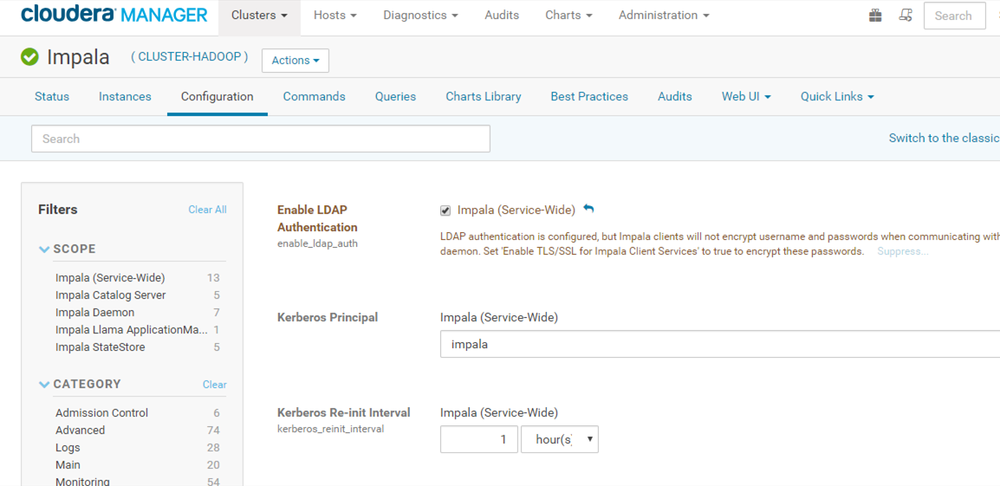

[Documentação](../../../../../documentacao.md) > [Projetos](../../../../projetos.md) > [Autenticacao](../../../autenticacao.md) > [Componentes](../../componentes.md) > [Impala](../impala.md)

# Integracao com Ldap

No cloudera manager, acesse Impala → Configuration → Security

depois preencha os seguintes campos:

**enable\_ldap\_auth**

**ldap\_uri**: <ldaps://ldap.uolcorp.intranet:636>

**ldap\_domain**: uolcorp.intranet

**ldap\_ca\_certificate**: caminho do certificado (.pem)
