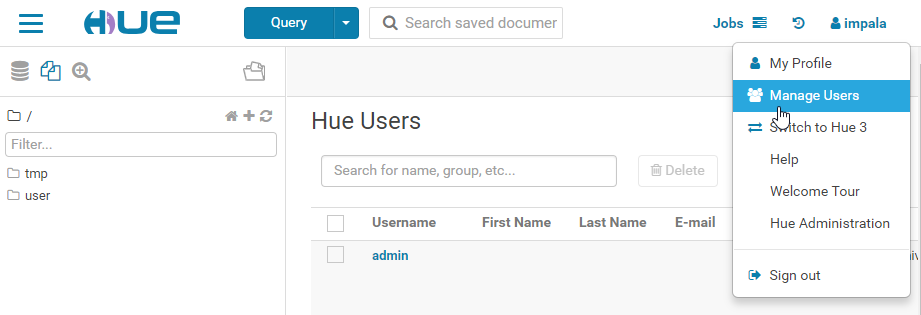
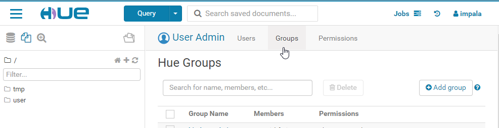

[Documentação](../../../../../documentacao.md) > [Projetos](../../../../projetos.md) > [Autenticacao](../../../autenticacao.md) > [Componentes](../../componentes.md) > [Sentry](../sentry.md)

# Atribuindo permissoes com o Sentry habilitado HDFS, Impala, Hive e Hue

1. ### Criar os usuários e grupos no Hue

   **Acesse o Hue com o user Impala, clique em "Manage Users"**

   

   **No menu superior, tem a divisão de Users e Groups , que tem seu respectivo botão de "Adicionar" a direita, basta clicar no botão e preencher o formulario que será exibido (é bem intuitivo, então não vou detalhar aqui).**

   
2. ### Criar os usuarios e grupos no ImpalaCatalog Server e em todos os Impala Daemons (utility-node1-dev, worker-node1-dev, worker-node2-dev, worker-node3-dev)

   ```bash
   #Acessar cada maquina via SSH e executar os comandos abaixo

   useradd user_teste
   groupadd group_teste
   usermod -a -G group_teste user_teste


   #para conferir se os usuarios foram criados corretamente no grupo, é só verificar o arquivo /etc/group
   #este arquivo tem a lista de todos os grupos, com o nome do grupos, id e lista de usuarios
   #o nosso exemplo seria adicionado no final do arquivo, da seguinte forma:


   group_teste:x:1006:user_teste


   #criou o usuario errado? Mata ele! (remove recursivamente tudo desse user)
   userdel -rf user_teste
   ```
3. ### Criar as regras de permissão e atribuir aos grupos de usuarios

   [image2019-1-8_16-30-6.png](../../../../../../attachments/223770670.png)

   ```sql
   --Role de administrador
   CREATE ROLE admin_role;
   GRANT ALL ON SERVER server1 TO ROLE admin_role WITH GRANT OPTION;
   GRANT ROLE admin_role TO GROUP impala;
   INVALIDATE METADATA;


   --Role manut
   CREATE ROLE manut_bigdata;
   GRANT ROLE manut_bigdata TO GROUP group_teste;
   GRANT select ON table auth_adm.product TO ROLE manut_bigdata;
   INVALIDATE METADATA;
   ```

   **Lista completa dos grants:**[image2019-1-8_16-30-6.png](../../../../../../attachments/223770670.png)
