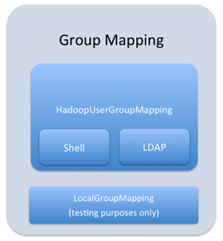
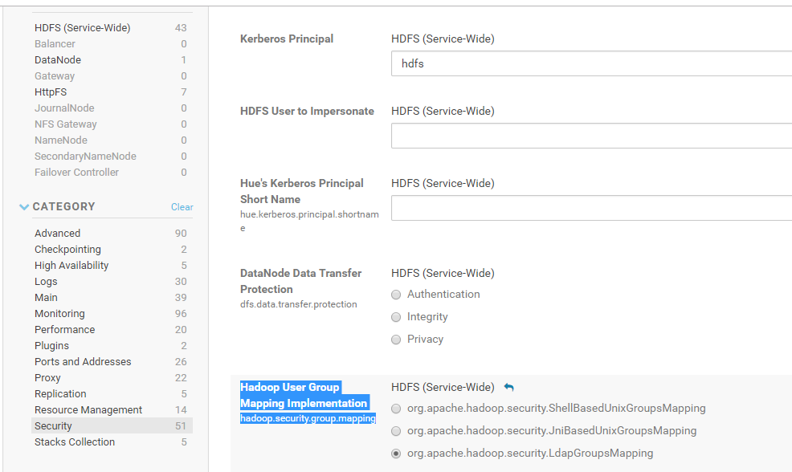
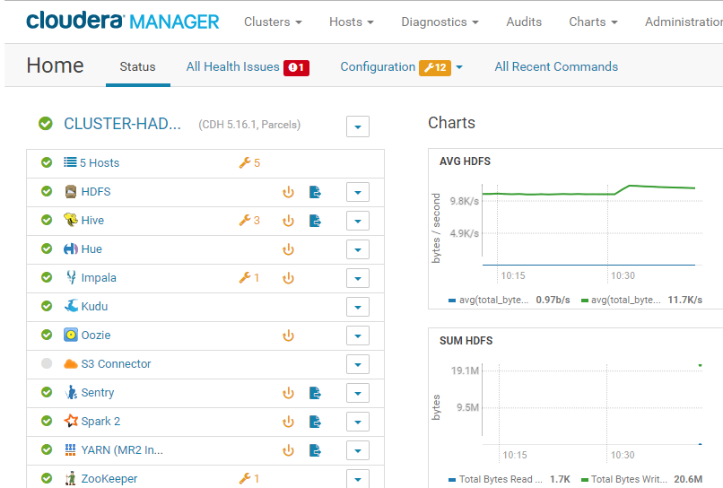

[Documentação](../../../../../documentacao.md) > [Projetos](../../../../projetos.md) > [Autenticacao](../../../autenticacao.md) > [Componentes](../../componentes.md) > [Sentry](../sentry.md)

# Mapeamento de grupos ldap Sentry

Para listar o grupo(s) do usuário, o Apache sentry se baseia no parâmetro hadoop.security.group.mapping, do hadoop, que, por default, é definido como "org.apache.hadoop.security.ShellBasedUnixGroupsMapping", o que significa que o hadoop fará a leitura dos grupos na máquina no qual o processo é executado, ou seja, local. Isso implica na criação do grupo(s) em todas as máquinas, caso haja integração sentry + impala.

A fim de fazer a integração ldap e não ter que criar grupos em todas as máquinas, é possível alterar o valor para org.apache.hadoop.security.LdapGroupsMapping, o que faz com que o hadoop leia os grupos do AD.

Conforme figura abaixo, é possível ver como o sentry trabalha com o mapeamento de grupos:

**Procedimento para alterar o parâmetro hadoop.security.group.mapping**:

1. No cloudera manager, clique em HDFS → configuration → security e altere a cofnig para **org.apache.hadoop.security.LdapGroupsMapping**  
   
2. Após isso, será necessário reiniciar todos os serviços dependentes do HDFS

   
