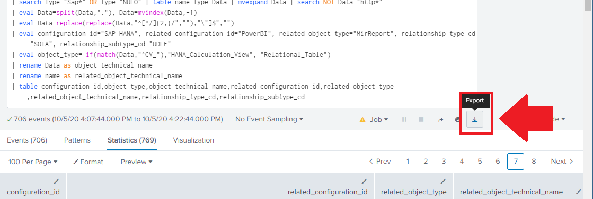

[Documentação](../../documentacao.md) > [Splunk](../splunk.md)

# Comandos para gerar CSV de metadatados do PowerBI para o time de Governanca

No final de 2019, o Leoneti desenvolveu um script, que extrai dados do PowerBI para o time de governança, para ser utilizado no Information Steward. A execução desse script ainda é manual, e até que o desenvolvimento de um novo pipeline em Python não seja concluido, é preciso executar os comandos na sequencia abaixo, salvar o CSV e enviar para o time de gov (ou realizar a automação no splunk)

Abra o painel de Search do Splunk e digite os comandos abaixo, ou simplestemente clique nos links no final de cada bloco

**Comando 1) Baixar os metadados do PowerBI** Expandir origem

```java
| powerbimetadata reports download force=f proxy=t | table *
```

**Link**: [Baixar os metadados do PowerBI](http://a1-istambul1.host.intranet:8000/en-US/app/search/search?q=%7C%20powerbimetadata%20reports%20download%20force%3Df%20proxy%3Dt%20%7C%20table%20*&sid=1601923966.133238&display.page.search.mode=verbose&dispatch.sample_ratio=1&workload_pool=&earliest=-15m&latest=now&display.page.search.tab=statistics&display.general.type=statistics)

**Comando 2) Buscar e formatar os dados** Expandir origem

```java
| powerbimetadata reports info | spath input=_raw path=Items.Item{}.StableEntries.LastAnalysisServicesFormulaText.RootFormulaText output=RootFormulaText | fields - LocalPackageMetadataFile
| table groupId groupName id name dataset_id file_size filename tables RootFormulaText *
| eval tablesdata=if( isnull(RootFormulaText) and isnull(selectTables), internalTables, selectTables)
| rex max_match=0 field=RootFormulaText "(?ims)(?<dbtype>(?:SapHana\.Database|Oracle\.Database|SharePoint\.Tables|Odbc\.Query|Folder\.Files|DataLake\.Contents|AzureStorage\.Blobs))\([\'\"](?<dbhost>[^\"\']*)"
| rex max_match=0 field=RootFormulaText "(?ims)(?<sqltype>Sql\.Database)\(\"(?<sqlhost>[^\"]*)\"[,\s]+\"(?<sqlnamedata>[^\"]*)\""
| rex max_match=0 field=RootFormulaText "(?ims)(?<filetype>(?:Excel\.Workbook|Csv\.Document|Json\.Document|Access\.Database))\((?:File|Web)\.Contents\([\"]{0,1}(?<filepathdata>[^\"]*)"
| rex max_match=0 field=RootFormulaText "(?ims)(?<sapcubetype>SapBusinessWarehouse\.Cubes)\(\"(?<sapcubehost>[^\"]*).*\[Id=\"(?<sapcubedata>[^\"]*)"
| rex max_match=0 field=RootFormulaText "(?im)let\W+.*(?<saphanatype>SapHana\.Database)\W+(?<saphanahost>[^\"\']*)[^{]*\{[^{]*\{[^{]*\{\[Name=\W+(?<saphanadata>[^\"\']*)"
| foreach *type [eval Type=mvdedup(mvappend(Type,'<<FIELD>>')) ] | fields - *type
| foreach *host [eval Host=mvdedup(mvappend(Host,'<<FIELD>>')) ] | fields - *host
| foreach *data [eval Data=mvdedup(mvappend(Data,'<<FIELD>>')) ] | fields - *data
| eval Data=if(isnull(Data),Host,Data), Host=if(Host=Data,null(),Host)
| table groupId groupName id name dataset_id file_size filename Type Host Data RootFormulaText
| fillnull value="NULO" Type
| search Type="Sap*" OR Type="NULO" | table name Type Data | mvexpand Data | search NOT Data="http*"
| eval Data=split(Data,"."), Data=mvindex(Data,-1)
| eval Data=replace(replace(Data,"^[^/]{2,}/",""),"\"]$","")
| eval configuration_id="SAP_HANA", related_configuration_id="PowerBI", related_object_type="MirReport", relationship_type_cd="SOTA", relationship_subtype_cd="UDEF"
| eval object_type= if(match(Data,"^CV_"),"HANA_Calculation_View", "Relational_Table")
| rename Data as object_technical_name
| rename name as related_object_technical_name
| table configuration_id,object_type,object_technical_name,related_configuration_id,related_object_type,related_object_technical_name,relationship_type_cd,relationship_subtype_cd
```

**Link:** [Buscar e formatar os dados](http://a1-istambul1.host.intranet:8000/en-US/app/bizmon-app/search?q=%7C%20powerbimetadata%20reports%20info%20%7C%20spath%20input%3D_raw%20path%3DItems.Item%7B%7D.StableEntries.LastAnalysisServicesFormulaText.RootFormulaText%20output%3DRootFormulaText%20%7C%20fields%20-%20LocalPackageMetadataFile%0A%7C%20table%20groupId%20groupName%20id%20name%20dataset_id%20file_size%20filename%20tables%20RootFormulaText%20*%0A%7C%20eval%20tablesdata%3Dif(%20isnull(RootFormulaText)%20and%20isnull(selectTables)%2C%20internalTables%2C%20selectTables)%0A%7C%20rex%20max_match%3D0%20field%3DRootFormulaText%20%22(%3Fims)(%3F%3Cdbtype%3E(%3F%3ASapHana%5C.Database%7COracle%5C.Database%7CSharePoint%5C.Tables%7COdbc%5C.Query%7CFolder%5C.Files%7CDataLake%5C.Contents%7CAzureStorage%5C.Blobs))%5C(%5B%5C%27%5C%22%5D(%3F%3Cdbhost%3E%5B%5E%5C%22%5C%27%5D*)%22%0A%7C%20rex%20max_match%3D0%20field%3DRootFormulaText%20%22(%3Fims)(%3F%3Csqltype%3ESql%5C.Database)%5C(%5C%22(%3F%3Csqlhost%3E%5B%5E%5C%22%5D*)%5C%22%5B%2C%5Cs%5D%2B%5C%22(%3F%3Csqlnamedata%3E%5B%5E%5C%22%5D*)%5C%22%22%0A%7C%20rex%20max_match%3D0%20field%3DRootFormulaText%20%22(%3Fims)(%3F%3Cfiletype%3E(%3F%3AExcel%5C.Workbook%7CCsv%5C.Document%7CJson%5C.Document%7CAccess%5C.Database))%5C((%3F%3AFile%7CWeb)%5C.Contents%5C(%5B%5C%22%5D%7B0%2C1%7D(%3F%3Cfilepathdata%3E%5B%5E%5C%22%5D*)%22%0A%7C%20rex%20max_match%3D0%20field%3DRootFormulaText%20%22(%3Fims)(%3F%3Csapcubetype%3ESapBusinessWarehouse%5C.Cubes)%5C(%5C%22(%3F%3Csapcubehost%3E%5B%5E%5C%22%5D*).*%5C%5BId%3D%5C%22(%3F%3Csapcubedata%3E%5B%5E%5C%22%5D*)%22%0A%7C%20rex%20max_match%3D0%20field%3DRootFormulaText%20%22(%3Fim)let%5CW%2B.*(%3F%3Csaphanatype%3ESapHana%5C.Database)%5CW%2B(%3F%3Csaphanahost%3E%5B%5E%5C%22%5C%27%5D*)%5B%5E%7B%5D*%5C%7B%5B%5E%7B%5D*%5C%7B%5B%5E%7B%5D*%5C%7B%5C%5BName%3D%5CW%2B(%3F%3Csaphanadata%3E%5B%5E%5C%22%5C%27%5D*)%22%0A%7C%20foreach%20*type%20%5Beval%20Type%3Dmvdedup(mvappend(Type%2C%27%3C%3CFIELD%3E%3E%27))%20%5D%20%7C%20fields%20-%20*type%0A%7C%20foreach%20*host%20%5Beval%20Host%3Dmvdedup(mvappend(Host%2C%27%3C%3CFIELD%3E%3E%27))%20%5D%20%7C%20fields%20-%20*host%0A%7C%20foreach%20*data%20%5Beval%20Data%3Dmvdedup(mvappend(Data%2C%27%3C%3CFIELD%3E%3E%27))%20%5D%20%7C%20fields%20-%20*data%0A%7C%20eval%20Data%3Dif(isnull(Data)%2CHost%2CData)%2C%20Host%3Dif(Host%3DData%2Cnull()%2CHost)%0A%7C%20table%20groupId%20groupName%20id%20name%20dataset_id%20file_size%20filename%20Type%20Host%20Data%20RootFormulaText%0A%7C%20fillnull%20value%3D%22NULO%22%20Type%0A%7C%20search%20Type%3D%22Sap*%22%20OR%20Type%3D%22NULO%22%20%7C%20table%20name%20Type%20Data%20%7C%20mvexpand%20Data%20%7C%20search%20NOT%20Data%3D%22http*%22%0A%7C%20eval%20Data%3Dsplit(Data%2C%22.%22)%2C%20Data%3Dmvindex(Data%2C-1)%0A%7C%20eval%20Data%3Dreplace(replace(Data%2C%22%5E%5B%5E%2F%5D%7B2%2C%7D%2F%22%2C%22%22)%2C%22%5C%22%5D%24%22%2C%22%22)%0A%7C%20eval%20configuration_id%3D%22SAP_HANA%22%2C%20related_configuration_id%3D%22PowerBI%22%2C%20related_object_type%3D%22MirReport%22%2C%20relationship_type_cd%3D%22SOTA%22%2C%20relationship_subtype_cd%3D%22UDEF%22%0A%7C%20eval%20object_type%3D%20if(match(Data%2C%22%5ECV_%22)%2C%22HANA_Calculation_View%22%2C%20%22Relational_Table%22)%0A%7C%20rename%20Data%20as%20object_technical_name%0A%7C%20rename%20name%20as%20related_object_technical_name%0A%7C%20table%20configuration_id%2Cobject_type%2Cobject_technical_name%2Crelated_configuration_id%2Crelated_object_type%2Crelated_object_technical_name%2Crelationship_type_cd%2Crelationship_subtype_cd&display.page.search.mode=verbose&dispatch.sample_ratio=1&workload_pool=&earliest=-15m&latest=now&display.page.search.tab=statistics&display.general.type=statistics&display.prefs.statistics.offset=600&sid=1601925764.134311)

Após a conclusão do "Comando 2)" , clique no botão "Export" localizado abaixo da Search Box, conforme indicado na imagem abaixo. Salve o arquivo CSV e envie para o time de Governança


