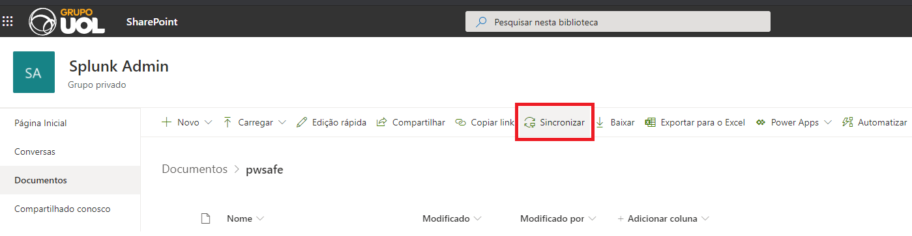
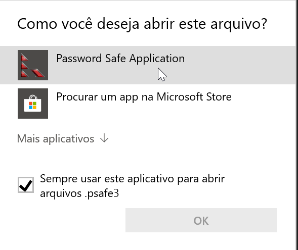
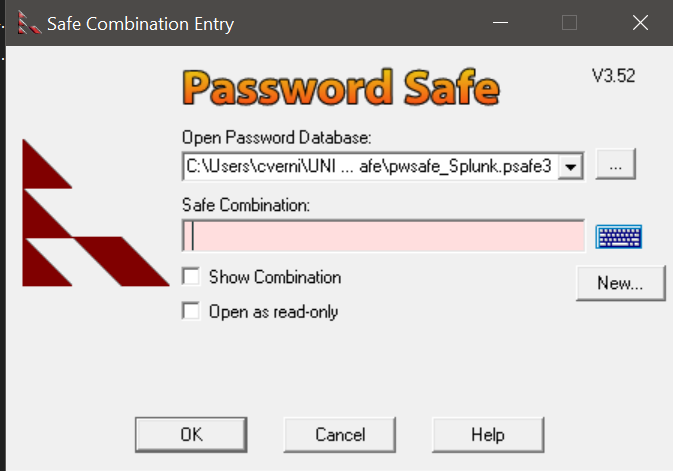
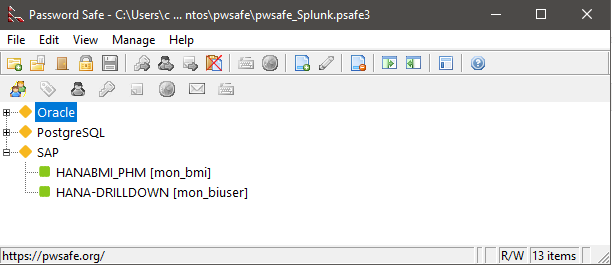

[Documentação](../../documentacao.md) > [Splunk](../splunk.md)

# Gerenciador de senhas do Splunk

As senhas dos usuarios de banco do Splunk estão armazenadas no nosso gerenciador de senhas, que está compartilhado no grupo SplunkAdmin no Sharepoint. Para consultar as senhas, siga o passo a passo abaixo.

Instale o gerenciador de senhas

Utilizamos o Password Safe como gerenciador de senhas, acesse <https://pwsafe.org/> e instale o software no seu computador/notebook. Para quem tem a imagem linux oficial da empresa, basta instalar via apt-get, usando "**apt install passwordsafe**"

Sincronize o diretorio do Sharepoint com o Onedrive da sua maquina, para ter sempre o arquivo atualizado

Acesse o link <https://uolinc.sharepoint.com/:f:/r/sites/SplunkAdmin/Documentos%20Partilhados/pwsafe?csf=1&web=1&e=4e5KS4>  e clique em "Sincronizar" , para ter sempre o arquivo atualizado na sua maquina.

Configure para abrir arquivos ".psafe3" com o Password Safe

Localize o arquivo pwsafe\_Splunk.psafe3, e clique com o botão direito, selecione "Abrir com" e selecione para sempre abrir esse arquivo com o app Password Safe

Abra o arquivo pwsafe\_Splunk.psafe3

Digite a senha mestre que foi encaminhada para seu e-mail, no campo "Safe Combination"

Pronto, voce está no painel do gerenciador de senhas

Para copiar a senha de um usuario, basta clicar duas vezes no nome de uma conexão

