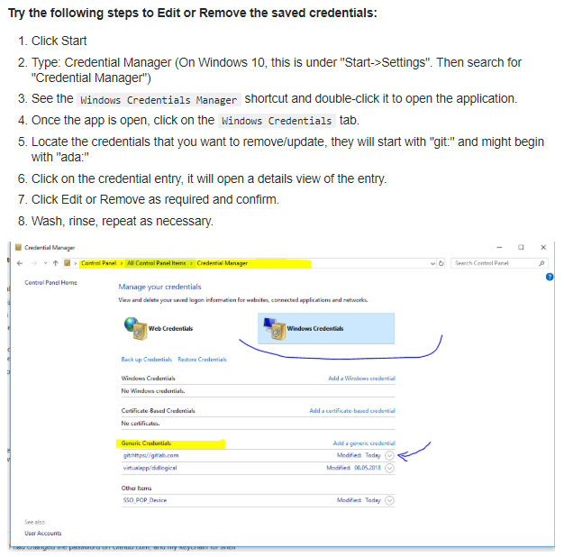

[Documentação](../../documentacao.md) > [Stash](../stash.md)

# Erro git fatal Authentication failed no Stash apos alterar a senha de rede

Se você alterou sua senha de rede recentemente, e agora está tomando o erro de "git fatal: Authentication failed for..." na hora de fazer alguma coisa no Stash, basta executar o procedimento abaixo:



Você também tem a opção de executar o seguinte comando no terminal:

```java
git config --global credential.helper wincred
```

Assim, na próxima tentativa de atualização, uma tela de login e senha aparecerá.
