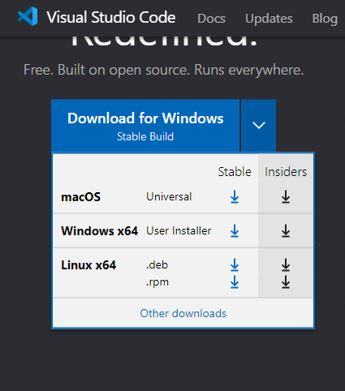
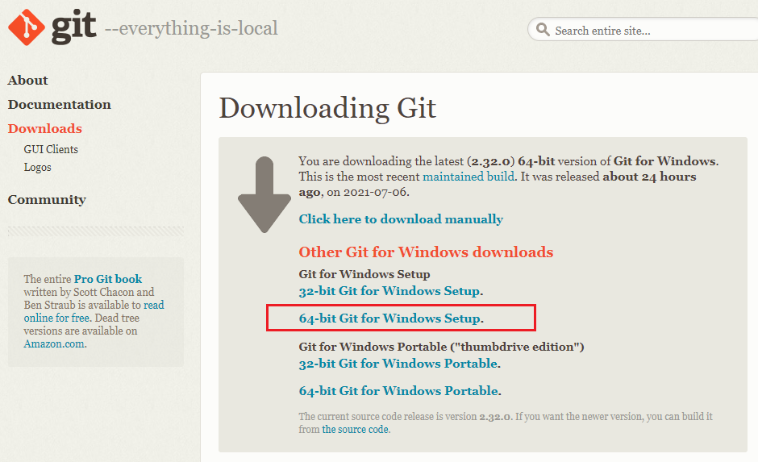

[Documentação](../../documentacao.md) > [Stash](../stash.md)

# Visual Studio Code

**O que é:**É um editor de código aberto (IDE) desenvolvido pela Microsoft e de utilização gratuita. Ele disponibilza a aplicação de várias extensões que permitem o desenvolvimento em várias linguagens de programação.

**Finalidade:**No UOL utilizamos o Visual Studio Code basicamente como ferramenta de integração com o Stash (GitHub) para sincronização, controle de versão e deployment dos projetos em andamento.

**Onde Baixar:** Pode ser baixado no link abaixo para os sistemas operacionais Windows, Linux e MacOS.

- - - <https://code.visualstudio.com/>

**Add-On:**Após o Download e instalação do VSC é necessário o download e instalação do GIT. Somente após a isntalação do GIT será possivel a configuração do VSC no Stash.

- - - <https://git-scm.com/download/win>

